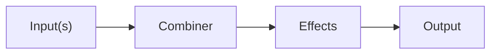
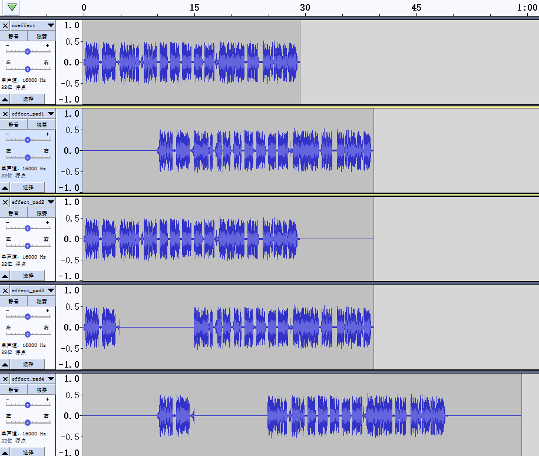
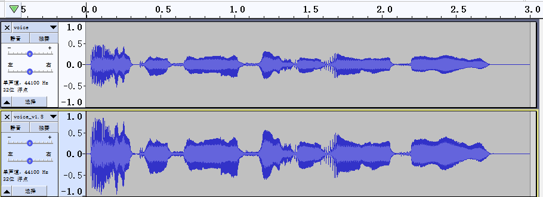
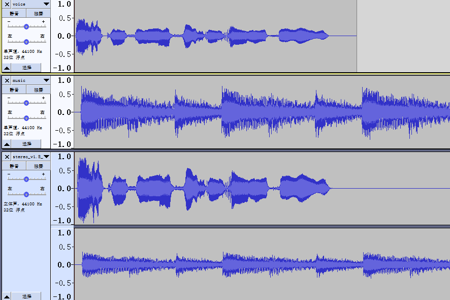
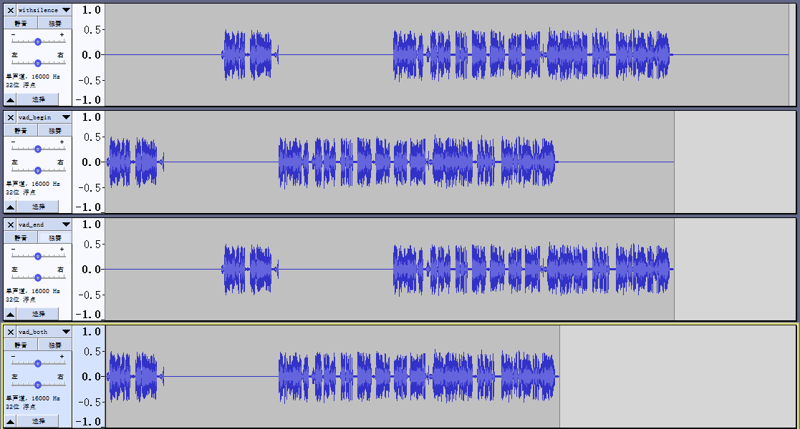
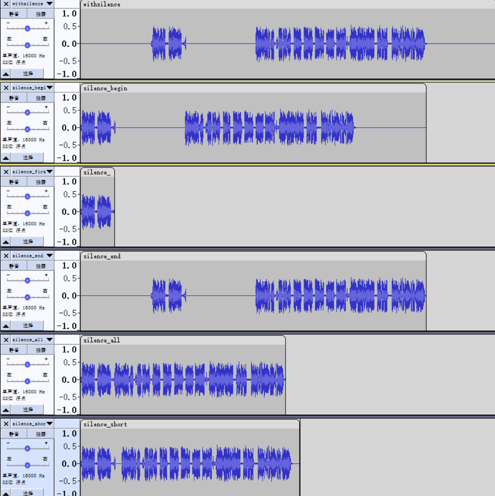
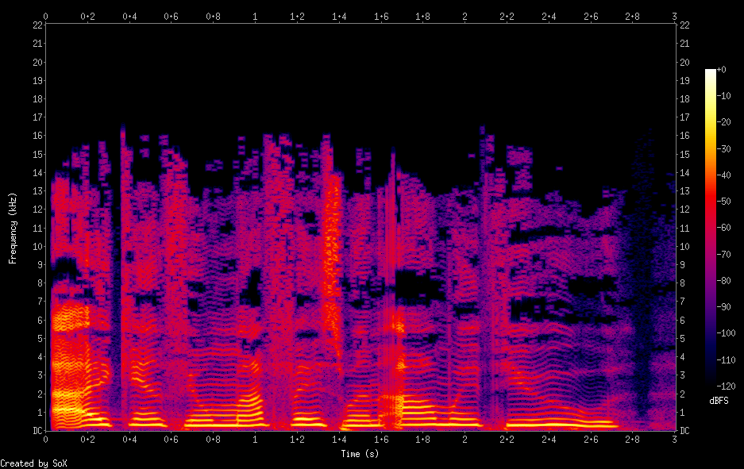
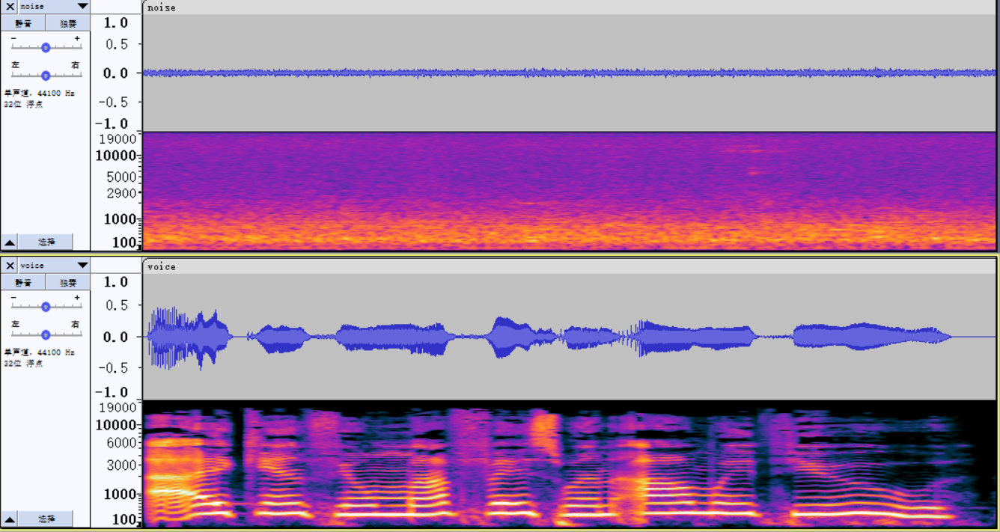
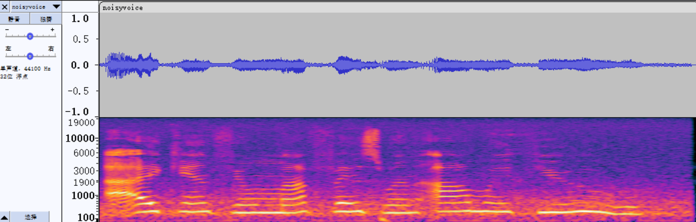
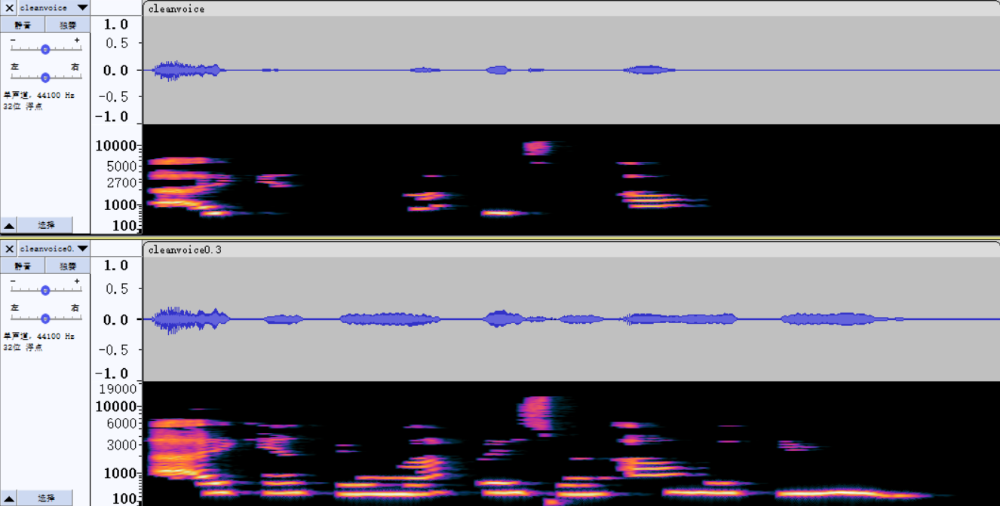

# 简介

SoX（Sound eXchange），是一款交互式的音频编辑器，自称为音频处理的瑞士军刀。SoX 是一个跨平台（Windows、Linux、MacOS X 等）命令行程序，可以将各种格式的音频文件转换为需要的其他格式，还可以对音频文件应用各种效果。并且SoX 还支持在大多数平台上录制和播放音频。除了提供命令行程序外，SoX还提供了开发库供开发人员使用。

SoX是一个开源软件，遵守GPLv2协议，官方网站为：[http://sox.sourceforge.net/](http://sox.sourceforge.net/ "http://sox.sourceforge.net/")。最新版本为14.4.2，发布于2015年2月22日。

# 安装SoX

对于开源软件，一般都有两种安装方式，即通过源码安装和直接安装发布版。

## 源码安装

首先需要下载SoX源码，可以直接从项目的文件[下载地址](https://sourceforge.net/projects/sox/files/ "下载地址")下载源码包，也可以通过git下载。

```bash
git clone git://git.code.sf.net/p/sox/code sox
```

在执行编译前，需要保证已经安装了需要的工具集。

```bash
sudo apt install autoconf
sudo apt install libtool
sudo apt install make
sudo apt install automake
sudo apt install gcc

```

SoX的实现依赖一些第三方的库，在编译和安装SoX前，这些库需要正确安装。以下是这些库的地址和使用的协议。

```ybsz
OpencoreAMR-NB/WB http://sourceforge.net/projects/opencore-amr  Apache
AMR-NB/WB         http://www.penguin.cz/~utx/amr        See library web page
AO                http://xiph.org/ao                    GPL
FLAC              http://flac.sourceforge.net           BSD
LADSPA            http://www.ladspa.org                 LGPL + plugins' licence
Lame MP3 encoder  http://lame.sourceforge.net           LGPL
Twolame MP2 enc.  http://www.twolame.org                LGPL
libltdl           http://www.gnu.org/software/libtool   LGPL
MAD MP3 decoder   http://www.underbit.com/products/mad  GPL
MP3 ID3 tags      http://www.underbit.com/products/mad  GPL
Magic             http://www.darwinsys.com/file         BSD
Ogg Vorbis        http://www.vorbis.com                 BSD
Opus              http://www.opus-codec.org/            BSD
PNG               http://www.libpng.org/pub/png         zlib (BSD-like)
Sndfile           http://www.mega-nerd.com/libsndfile   LGPL
WavPack           http://www.wavpack.com                BSD
```

准备工作完成后，进入sox目录，按照以下流程进行编译和安装。

```bash
autoreconf -i
./configure
make
make install
```

在使用源码进行编译安装时，要保证安装工具集的版本和代码要求的版本匹配，否则容易出现不兼容的问题，这些问题有时候并不容易解决。因此，如果不是对源码进行学习和修改，建议直接安装发布版。

## 使用包管理器安装

由于SoX的广泛使用，各平台都可以使用包管理器都能直接安装。Linux系统下：

```bash
$ sudo apt install sox
```

Mac OS下：

```bash
$ brew install sox
```

Windows系统下：

```powershell
$ choco install sox
```

由于专利限制原因，sox默认并未打包MP3和AMR等格式的处理库，需要额外安装所需的库文件。在Linux下只需要安装libsox-fmt-all软件包即可。

```bash
$ sudo apt install libsox-fmt-all

```

Mac OS下如果要安装额外的格式，则需要在安装时指定选项：

```bash
$ brew install sox --with-flac --with-lame --with-libao --with-libsndfile \
       --with-libvorbis --with-opencore-amr --with-opusfile
```

## 直接安装

Windows和Mac OS下也可以直接从项目的文件[下载地址](https://sourceforge.net/projects/sox/files/ "下载地址")下载已经编译好的文件。但MP3和AMR的支持需要自行下载所需库的源文件进行编译、安装。由于Windows系统上使用MSYS环境来进行编译，编译前需要保证正确安装配置MSYS。

### MP3编解码支持

从以下地址下载源代码：

```text
Lame MP3 encoder  http://lame.sourceforge.net
MAD MP3 decoder   http://www.underbit.com/products/mad

```

解压后执行编译和安装命令。

Windows系统执行以下步骤：

```bash
cd lame-398-2
./configure --disabled-static --enable-shared
make
cp libmp3lame/.libs/libmp3lame-0.dll /path/to/sox

cd libmad-0.15.1b
./configure --enable-shared --disable-static LDFLAGS="-no-undefined"
# edit Makefile, search for "-fforce-mem" and delete it.
make
cp libmad-0.dll /path/to/sox/

```

Mac系统执行以下步骤：

```bash
cd lame-398-2
./configure CFLAGS="-arch i386 -m32" LDFALGS="-arch i386"
make
sudo make install

cd libmad-0.15.1b
./configure CFLAGS="-arch i386 -m32" LDFALGS="-arch i386"
make
sudo make install
```

### AMR编解码支持

从以下地址下载源代码：

```text
http://sourceforge.net/projects/opencore-amr 
```

解压后执行编译和安装命令。

Windows系统执行以下步骤：

```bash
cd opencore-amr-0.1.2
./configure --enable-shared --disable-static LDFLAGS="-no-undefined"
make
cp amrnb/.libs/libopencore-amrnb-0.dll /path/to/sox
cp amrwb/.libs/libopencore-amrwb-0.dll /path/to/sox
```

Mac系统可以直接运行`./build_osx.sh`或者执行以下步骤：

```bash
cd opencore-amr-0.1.2
./configure CFLAGS="-arch i386 -m32" LDFALGS="-arch i386"
make
sudo make install

```

## 安装wget

SoX处理网络音频时基于wget命令，因此若通过网络协议对音频进行处理，需要先安装wget。

```bash
sudo apt install wget
```

# SoX功能介绍

安装好之后，我们就可以使用sox命令来对音频文件进行操作了。SoX一共有四个命令，即sox、soxi、rec和play。事实上其余三个命令都是sox的软链接，目的是以更直观的方式完成特定的目的，程序内部对命令的名称进行检查，从而作出不同的操作。

soxi：显示音频文件的信息，主要是格式信息；

rec：调用系统的默认录音设备进行录音，实际上是将系统的默认录音设别重定向至sox命令的输入文件；

play：调用系统的默认播放设备播放音频，实际上是将sox命令的输出重定向至系统的默认音频设备。

## SoX的音频处理流程

如果使用`sox --help`查看sox命令的使用说明，可以看到其输入可以是多个，但是输出仅有一个。

```bash
$ sox --help
sox:      SoX v14.4.1

Usage summary: [gopts] [[fopts] infile]... [fopts] outfile [effect [effopt]]...
```

这与sox命令的工作流程有关，其对音频的处理流程为：



1.  对输入音频格式进行解析，读入音频信号；

2.  如果输入是多个音频，则将所有音频信号进行合并；

3.  对合并后的音频信号应用选择的1个或多个效果;

4.  根据选择的输出格式，对音频信号进行编码，并输出。

## SoX支持的音频格式

SoX支持对有头部和无头部音频文件的处理。对于有头部信息的音频文件（例如WAV，MP3和FLAC等），可以通过头部获取音频数据的信号和编码的属性信息，而对音频进行解码。对于没有头部的音频文件，音频特性信息要从命令行参数中指定，至少要指定采样频率（Sample Rate）、采样精度（Precision/Sample Size）、声道数（Channels）和信号编码类型（Sample Encoding），分别使用 `-r/--ate` 、`-b/--its`、`-c/--hannels`和`-e/--ncoding`参数。

例如，我们要将一个WAV文件转成MP3文件，如果WAV文件有头部信息，则只需要使用如下命令：

```bash
$ sox 01.wav 01.mp3
```

如果WAV文件没有头部信息，则需要使用参数进行指定：

```bash
$ sox -r 44100 -b 16 -c 2 -e signed-integer 01.raw  01.mp3
```

SoX支持对大部分主流的音频编码格式进行处理，具体如下：

```markdown
* Raw files in various binary formats
* Raw textual data
* Amiga 8svx files
* Apple/SGI AIFF files
* SUN .au files
  * PCM, u-law, A-law
  * G7xx ADPCM files (read only)
  * mutant DEC .au files
  * NeXT .snd files
* AVR files
* CDDA (Compact Disc Digital Audio format)
* CVS and VMS files (continuous variable slope)
* Grandstream ring-tone files
* GSM files
* HTK files
* LPC-10 files
* Macintosh HCOM files
* Amiga MAUD files
* AMR-WB & AMR-NB (with optional libamrwb & libamrnb libraries)
* MP2/MP3 (with optional libmad, libtwolame and libmp3lame libraries)
* MP4, AAC, AC3, WAVPACK, AMR-NB files (with optional ffmpeg library)
* AVI, WMV, Ogg Theora, MPEG video files (with optional ffmpeg library)
* Ogg Vorbis files (with optional Ogg Vorbis libraries)
* FLAC files (with optional libFLAC)
* IRCAM SoundFile files
* NIST SPHERE files
* Turtle beach SampleVision files
* Sounder & Soundtool (DOS) files
* Yamaha TX-16W sampler files
* SoundBlaster .VOC files
* Dialogic/OKI ADPCM files (.VOX)
* Microsoft .WAV files
  * PCM, floating point
  * u-law, A-law, MS ADPCM, IMA (DMI) ADPCM
  * GSM
  * RIFX (big endian)
* WavPack files (with optional libwavpack library)
* Psion (palmtop) A-law WVE files and Record voice notes
* Maxis XA Audio files
  * EA ADPCM (read support only, for now)
* Pseudo formats that allow direct playing/recording from most audio devices
* The "null" pseudo-file that reads and writes from/to nowhere
```

想查看SoX支持的某种格式的具体信息可以使用`sox --help-format <format-name>`命令来查看，如果想查看所有格式的信息可以使用`sox --help-format all`命令来查看。

## SoX的音频合并方式

SoX对多个音频合并时，有不同的合并方式可以选择，具体为：

*   Concatenate：以拼接的方式合并（sox命令默认的合并方式）；

*   Mix：以混合的方式合并；

*   Merge：以声道并行的方式合并， 如将两个单声道的音频混合成一个双声道的音频；

*   Sequence：按顺序播放音频文件或者流（仅用于play命令）；

*   Multiply ：将来自所有音频的相应信道的样本相乘；

*   Mix-Power：类似于Mix，但是对音量进行均衡调整。

音频合并方式使用`--combine`参数指定，具体的：

*   Concatenate：`--combine concatenate`，sox命令中不需要显示指定；

*   Mix：`--combine mix`或者简写`-m`；

*   Merge：`--combine merge`或者简写`-M`；

*   Sequence：`--combine sequence`，play命令中不需要显示指定，在sox命令中若指定该选项，效果和Concatenate方法相同。

*   Multiply ：`--combine multiply`或者简写`-T`；

*   Mix-Power：`--combine mix-power`。

以voice.mp3和music.mp3两个单声道的音频文件举例，voice.mp3中是人声，music.mp3中是一段音乐。

[voice.mp3](audio/voice_apbsO6G6sF.mp3 "voice")

[music.mp3](audio/music_MdOnxLg20h.mp3)

首先使用soxi查看两个音频文件的基本信息：

```bash
$ soxi voice.mp3 music.mp3

Input File     : 'voice.mp3'
Channels       : 1
Sample Rate    : 44100
Precision      : 16-bit
Duration       : 00:00:03.03 = 133623 samples = 227.25 CDDA sectors
File Size      : 24.2k
Bit Rate       : 64.0k
Sample Encoding: MPEG audio (layer I, II or III)


Input File     : 'music.mp3'
Channels       : 1
Sample Rate    : 44100
Precision      : 16-bit
Duration       : 00:00:04.05 = 178561 samples = 303.675 CDDA sectors
File Size      : 32.4k
Bit Rate       : 64.0k
Sample Encoding: MPEG audio (layer I, II or III)

Total Duration of 2 files: 00:00:07.08
```

以下对Concatenate、Mix、Merge和Sequence几种合并方法进行详细说明。

### Concatenate

不加任何参数，使用默认的concatenate方式进行合并：

```bash
$ sox voice.mp3 music.mp3 concat.mp3
$ soxi concat.mp3

Input File     : 'concat.mp3'
Channels       : 1
Sample Rate    : 44100
Precision      : 16-bit
Duration       : 00:00:07.05 = 311037 samples = 528.974 CDDA sectors
File Size      : 56.4k
Bit Rate       : 64.0k
Sample Encoding: MPEG audio (layer I, II or III)

```

可以看到合并后的音频时长（Duration）是原来两个音频文件的总和。

[concat.mp3](audio/concat_jt-d3ozt9z.mp3)

### Mix

使用`-m`指定使用Mix方法合并两个音频文件：

```bash
$ sox -m voice.mp3 music.mp3 mix.mp3
$ soxi mix.mp3

Input File     : 'mix.mp3'
Channels       : 1
Sample Rate    : 44100
Precision      : 16-bit
Duration       : 00:00:04.05 = 178561 samples = 303.675 CDDA sectors
File Size      : 32.4k
Bit Rate       : 64.0k
Sample Encoding: MPEG audio (layer I, II or III)
```

可以看到合并后的音频仍是单声道，音频时长（Duration）与原来两个音频文件中较长的那个（music.mp3）相同。

[mix.mp3](audio/mix_U7RMrW7YNL.mp3)

### Merge

使用`-M`指定使用Merge方法合并两个音频文件：

```bash
$ sox -M voice.mp3 music.mp3 merge.mp3
$ soxi merge.mp3

Input File     : 'merge.mp3'
Channels       : 2
Sample Rate    : 44100
Precision      : 16-bit
Duration       : 00:00:08.10 = 357078 samples = 607.276 CDDA sectors
File Size      : 130k
Bit Rate       : 128k
Sample Encoding: MPEG audio (layer I, II or III)
```

可以看到合并后的音频是双声道，虽然音频时长（Duration）与原来两个音频文件中较长的那个（music.mp3）相同，但别特率是原来的两倍。

[merge.mp3](audio/merge_Da92ukDPsM.mp3)

### Sequence

不加任何参数，使用play命令播放两条音频文件，其默认使用sequence合并方法，效果就是播放完第一条后自动继续播放第二条。

```bash
$ play voice.mp3 music.mp3

voice.mp3:

 File Size: 24.2k     Bit Rate: 64.0k
  Encoding: MPEG audio
  Channels: 1 @ 16-bit
Samplerate: 44100Hz
Replaygain: off
  Duration: 00:00:03.03

In:98.1% 00:00:02.97 [00:00:00.06] Out:131k  [      |      ] Hd:5.4 Clip:0
music.mp3:

 File Size: 32.4k     Bit Rate: 64.0k
  Encoding: MPEG audio
  Channels: 1 @ 16-bit
Samplerate: 44100Hz
Replaygain: off
  Duration: 00:00:04.05

In:99.4% 00:00:04.02 [00:00:00.03] Out:310k  [      |      ] Hd:2.3 Clip:0
Done.
```

```bash
$ play --combine mix voice.mp3 music.mp3

voice.mp3:

 File Size: 24.2k     Bit Rate: 64.0k
  Encoding: MPEG audio
  Channels: 1 @ 16-bit
Samplerate: 44100Hz
Replaygain: off
  Duration: 00:00:03.03


music.mp3:

 File Size: 32.4k     Bit Rate: 64.0k
  Encoding: MPEG audio
  Channels: 1 @ 16-bit
Samplerate: 44100Hz
Replaygain: off
  Duration: 00:00:04.05

In:99.4% 00:00:04.02 [00:00:00.03] Out:177k  [      |      ]        Clip:0
Done.
```

对于sox和play命令，使用几种合并方式的效果完全相同，不同的是sox命令是将合并后的结果保存到指定的输出文件中，而play命令是将结果输出到默认的音频播放设备中。play命令中，对于mix和merge选项，都是将两条音频混合成一条单声道或双声道的语音，再播放出来，可以听到人声和音乐是同时播放（如果只看命令行，可以观察以“In”开头的播放状态行，有几行说明输入的音频文件经过处理后有几个最终文件被送入播放设备进行播放）。Sequence和Concatenate虽然意义上有不同，但都是一种时间上的先后顺序，对于sox和play命令来说，这两个选项的效果是相同的。

```bash
$ sox --combine sequence voice.mp3 music.mp3 seq.mp3
$ diff -s seq.mp3 concat.mp3
Files seq.mp3 and concat.mp3 are identical

```

## SoX支持的音频效果

在SoX中所有的除了对音频的编码、格式及合并的操作外，其它的操作都被认为是音频效果。例如对音频进行频谱分析也被认为是一种效果。其中一些效果比较简单(例如trim和remix效果)，而有些就比较复杂（例如ladspa，它本身又集成了不同的效果模块）。

SoX支持基本上常见的效果，具体如下：

```markdown
Tone/filter effects(音调/滤波效果)
  * allpass(全通): RBJ all-pass biquad IIR filter
  * bandpass(带通): RBJ band-pass biquad IIR filter
  * bandreject(带阻): RBJ band-reject biquad IIR filter
  * band(通带): SPKit resonator band-pass IIR filter
  * bass(低音): Tone control: RBJ shelving biquad IIR filter
  * equalizer(均衡): RBJ peaking equalisation biquad IIR filter
  * firfit+(FFTFIR滤波): FFT convolution FIR filter using given freq. response (W.I.P.)
  * highpass(高通): High-pass filter: Single pole or RBJ biquad IIR
  * hilbert(希尔伯特滤波): Hilbert transform filter (90 degrees phase shift)
  * lowpass(低通): Low-pass filter: single pole or RBJ biquad IIR
  * sinc(sinc滤波器): Sinc-windowed low/high-pass/band-pass/reject FIR
  * treble(高音): Tone control: RBJ shelving biquad IIR filter
Production effects(附加效果)
  * chorus(合唱): Make a single instrument sound like many
  * delay(延时): Delay one or more channels
  * echo(回声): Add an echo
  * echos(多回声): Add a sequence of echos
  * flanger(法兰效应): Stereo flanger
  * overdrive(过载): Non-linear distortion
  * phaser(相移): Phase shifter
  * repeat(重复): Loop the audio a number of times
  * reverb(混响): Add reverberation
  * reverse(翻转): Reverse the audio (to search for Satanic messages ;-)
  * tremolo(颤音): Sinusoidal volume modulation
Volume/level effects(音量幅度效果)
  * compand(幅度变化): Signal level compression/expansion/limiting
  * contrast(对比化): Phase contrast volume enhancement
  * dcshift(去直流): Apply or remove DC offset
  * fade(淡入淡出): Apply a fade-in and/or fade-out to the audio
  * gain(增益变化): Apply gain or attenuation; normalise/equalise/balance/headroom
  * loudness(响度控制): Gain control with ISO 226 loudness compensation
  * mcompand(多带幅度变化): Multi-band compression/expansion/limiting
  * norm(归一化): Normalise to 0dB (or other)
  * vol(音量调节): Adjust audio volume
Editing effects(编辑效果)
  * pad(填充): Pad (usually) the ends of the audio with silence
  * silence(去除静音): Remove portions of silence from the audio
  * splice(结合): Perform the equivalent of a cross-faded tape splice
  * trim(裁剪): Cuts portions out of the audio
  * vad(活动语音检测): Voice activity detector
Mixing effects(混音效果)
  * channels(声道混音): Auto mix or duplicate to change number of channels
  * divide+(分声道): Divide sample values by those in the 1st channel (W.I.P.)
  * remix(任意输出混音): Produce arbitrarily mixed output channels
  * swap(翻转声道): Swap stereo channels
Pitch/tempo effects(音调/节拍效果)
  * bend(弯曲声调): Bend pitch at given times without changing tempo
  * pitch(变调): Adjust pitch (= key) without changing tempo
  * speed(变速): Adjust pitch & tempo together
  * stretch(拉伸压缩): Adjust tempo without changing pitch (simple alg.)
  * tempo(变节拍): Adjust tempo without changing pitch (WSOLA alg.)
Mastering effects(高级效果)
  * dither(加入噪声): Add dither noise to increase quantisation SNR
  * rate(重采样): Change audio sampling rate
Specialised filters/mixers(特殊滤波器/混音器)
  * deemph(去加重): ISO 908 CD de-emphasis (shelving) IIR filter
  * earwax(耳机增强): Process CD audio to best effect for headphone use
  * noisered(去噪声): Filter out noise from the audio
  * oops(卡拉ok效应): Out Of Phase Stereo (or `Karaoke') effect
  * riaa(RIAA唱片均衡): RIAA vinyl playback equalisation
Analysis `effects'(分析)
  * noiseprof(噪声分析): Produce a DFT profile of the audio (use with noisered)
  * spectrogram(频谱分析): graph signal level vs. frequency & time (needs `libpng')
  * stat(状态分析): Enumerate audio peak & RMS levels, approx. freq., etc.
  * stats(多声道状态分析): Multichannel aware `stat'
Miscellaneous effects(多方面效应)
  * ladspa(Linux音频开发插件): Apply LADSPA plug-in effects e.g. CMT (Computer Music Toolkit)
  * synth(合成声音): Synthesise/modulate audio tones or noise signals
  * newfile(创建新文件): Create a new output file when an effects chain ends.
  * restart(重新开始): Restart 1st effects chain when multiple chains exist.
Low-level signal processing effects(低音量处理特效)
  * biquad(滤波): 2nd-order IIR filter using externally provided coefficients
  * downsample(滤波): Reduce sample rate by discarding samples
  * fir(fir滤波): FFT convolution FIR filter using externally provided coefficients
  * upsample(升采样): Increase sample rate by zero stuffing
```

在sox命令中，如果想查看某个具体的效果的使用方法可以使用`sox --elp-effect <effect-name>` ，如果要一次性查看说有的特效的使用方法，可以使用`sox --elp-effect all`命令来查看。

所有的效果都写在命令的最后。例如如果我们要使用remix效果取出上面merge.mp3中，左声道的人声，可以使用如下命令：

```bash
$ sox merge.mp3 left.mp3 remix 1
```

多个连续的效果按将按照顺序组成一个效果链，音频将按顺序应用效果链中的每一个效果，如下命令是应用了一个由两个效果组成的效果链。

```python
sox merge.mp3 left.mp3 remix trim 0 1
```

# 使用sox命令

sox命令使用的一般格式如下：

```bash
sox <inputfile> ...  <outputfile> [<effect> ...] 
```

sox命令的参数可分为三个部分：

1.  infile(s)：一个或多个输入文件；

2.  outfile：一个输出文件；

3.  effect(s)：零个、一个或多个音频效果。

全局和每个部分还可以使用选项来改变行为。更具体的格式如下：

```bash
sox [gopts] <[fopts] infile(s)> <[fopts] outfile> [<effect [effopts]>...] 
```

sox命令的全局选项（gopts）实际上是可以放在effect前的任何位置的。例如，如下面几条命令其实是等价的。

```bash
$ sox -M voice.mp3 music.mp3 merge.mp3
$ sox voice.mp3 -M music.mp3 merge.mp3
$ sox voice.mp3 music.mp3 -M merge.mp3
$ sox voice.mp3 music.mp3 merge.mp3 -M

```

每个输入和输出文件前都可以使用格式选项（fopts）来指定文件的格式。常用的格式选项有：

| 选项                        | 描述            |
| ------------------------- | ------------- |
| -b, --bits *BITS*         | 每个编码样本占用的数据位数 |
| -c, --channels *CHANNELS* | 音频文件包含的通道数    |
| -e, --encoding *ENCODING* | 音频文件的编码类型     |
| -r, --rate *RATE*         | 音频文件的采样率      |
| -t, --type *FILE-TYPE*    | 音频文件的文件类型     |

一般情况下，这些选项用于说明无头的音频文件的格式信息，但也可以用于覆盖由头文件头部中的格式信息。除了格式选项，sox命令还可以通过头部信息和后缀名等来确定音频文件的格式信息。首先要先确定文件类型，如果不存在`-t`选项，则以文件后缀名来确定文件类型，如果存在`-t`选项，则以该选项来确定文件类型，而忽略后缀名指定的类型。类型确定后，对于其他格式信息，输入文件通过命令行格式选项和音频头部信息来确定，而对于输出文件，则通过命令行格式选项和输入文件的格式信息来确定，命令行选项指定的信息要优先于其它方式获取的信息。如果命令无法获取足够的音频文件格式信息，将会报错。例如下边的例子，如果将music.mp3文件后缀名改为wav，sox命令尝试以WAV格式来解析该音频文件，解析错误，但如果加上`-t mp3`选项，则会忽略后缀名信息。

```bash
$ cp music.mp3 music.wav
$ sox music.wav temp.wav
sox FAIL formats: can't open input file `music.wav': WAVE: RIFF header not found
$ sox -t mp3 music.wav temp.wav
$ soxi temp.wav

Input File     : 'temp.wav'
Channels       : 1
Sample Rate    : 44100
Precision      : 16-bit
Duration       : 00:00:04.02 = 177408 samples = 301.714 CDDA sectors
File Size      : 355k
Bit Rate       : 706k
Sample Encoding: 16-bit Signed Integer PCM
```

对于输入和输出文件，除了可以指定文件名外，还可以使用一些特殊的参数，这些参数表示输入或输出为特殊的文件。sox支持以下特殊文件选项：

| 选项                   | 描述                                                                 |
| -------------------- | ------------------------------------------------------------------ |
| -                    | 标准输入或标准输出。可用于sox命令他通过管道将其它命令的输出作为输入，或其它命令将sox命令的输出作为输入。            |
| -d, --default-device | 默认音频设备。作为输入文件数时，sox命令将从默认音频输入设备获取数据；作为输出文件时，sox命令将向默认音频输出设备输出数据。   |
| -n, --null           | 空文件。作为输入文件时，相当于一个内容是无限长静音的音频文件；作为输出时，等价于没有输出文件（作为一些不需要输出情况的输出占位符）。 |
| -p, --sox-pipe       | sox管道。可用于将前一个sox命令的输出通过管道输入给下一个sox命令。                              |

通过`-d`选项可以实现播放和录制音频的功能。如下，前两条命令是等价的，后两条命令是等价的。

```bash
$ sox music.mp3 -d
$ play music.mp3

$ sox -d rec.wav
$ rec rec.wav

```

对于`-n`选项，下面的两个例子一个是对音频进行统计分析，不需要输出音频文件，一个是需要一个纯静音的音频作为输入。

```bash
$ sox music.mp3 -n stat
Samples read:            177408
Length (seconds):      4.022857
Scaled by:         2147483647.0
Maximum amplitude:     0.716003
Minimum amplitude:    -0.764693
Midline amplitude:    -0.024345
Mean    norm:          0.131625
Mean    amplitude:    -0.000002
RMS     amplitude:     0.171959
Maximum delta:         0.122485
Minimum delta:         0.000000
Mean    delta:         0.014139
RMS     delta:         0.019217
Rough   frequency:          784
Volume adjustment:        1.308

$ sox -n silence.wav trim 0 3
```

在sox命令的末尾，可以指定一个或多个效果，称之为效果链（effects chain）。顾名思义，就是在音频输出前，逐个应用效果链中的效果，前一个效果的输出作为后一个效果的输入。每个效果后可以有自己独特的参数。sox支持多个效果链，多个效果链之间以“:”分隔。

在众多效果中，有一类被称为伪效果（pseudo-effects）的效果，其并不对音频进行处理，而是改变命令的行为。其中newfile伪效果可以配合提前结束（未遇到文件结尾就停止处理，例如trim）效果使用，将已处理的音频保存为一个输出，将剩余的音频作为一个新的文件传入下一个效果。另一个伪效果是restart，它将当前输入重新送入第一个效果链，直到没有音频数据可用。这两个效果配合就可以产生多个输出的效果。如下的例子，将音频分为每个1秒的片段（经测试`sox music.mp3 music_sub.mp3 trim 0 1 : newfile : restart`和`sox music.mp3 music_sub.mp3 trim 0 1 newfile restart`的结果是相同的）。

```bash
$ sox music.mp3 music_sub.mp3 trim 0 1 : newfile : restart
sox WARN trim: Last 1 position(s) not reached (audio shorter than expected).
$ soxi music*.mp3 | grep -E '^Input|^Duration'
Input File     : 'music.mp3'
Duration       : 00:00:04.05 = 178561 samples = 303.675 CDDA sectors
Input File     : 'music_sub001.mp3'
Duration       : 00:00:01.04 = 46040 samples = 78.2993 CDDA sectors
Input File     : 'music_sub002.mp3'
Duration       : 00:00:01.04 = 46040 samples = 78.2993 CDDA sectors
Input File     : 'music_sub003.mp3'
Duration       : 00:00:01.04 = 46040 samples = 78.2993 CDDA sectors
Input File     : 'music_sub004.mp3'
Duration       : 00:00:01.04 = 46040 samples = 78.2993 CDDA sectors
Input File     : 'music_sub005.mp3'
Duration       : 00:00:00.03 = 1147 samples = 1.95068 CDDA sectors
```

## 录制和播放音频

sox提供了两个快捷方式（软链接）用于方便的进行音频录制和播放。其效果等效果于用`-d`参数指定输入或输出文件。录制和播放音频的方式如下：

*   录制：`rec <filename>`或`sox -d <filename>`；

*   播放：`play <filename>`或`sox <filename> -d`。

录制音频时，通过指定输出文件的类型和格式信息，可以录制出所需要格式的音频文件。如下面的例子，通过格式选项修改了录制音频的信道数、采样率和采样精度。

```bash
$ rec rec.wav

Input File     : 'default' (pulseaudio)
Channels       : 2
Sample Rate    : 48000
Precision      : 16-bit
Sample Encoding: 16-bit Signed Integer PCM

In:0.00% 00:00:07.42 [00:00:00.00] Out:352k  [      |      ]        Clip:0    ^C
Aborted.

$ rec -c 1 -r 16k -b 8 rec.wav

Input File     : 'default' (pulseaudio)
Channels       : 1
Sample Rate    : 16000
Precision      : 8-bit
Sample Encoding: 8-bit Signed Integer PCM

In:0.00% 00:00:08.19 [00:00:00.00] Out:123k  [      |      ]        Clip:0    ^C
Aborted.

```

默认情况下，使用“Ctrl+C”来终止录制。也可以使用trim效果录制指定时长的音频，这种情况下，录制完足够的音频后，命令会自动退出（这时终端输出的是“Done.”而不是“Aborted.”）。

```bash
$ rec rec.wav trim 0 10

Input File     : 'default' (pulseaudio)
Channels       : 2
Sample Rate    : 48000
Precision      : 16-bit
Sample Encoding: 16-bit Signed Integer PCM

In:0.00% 00:00:10.07 [00:00:00.00] Out:480k  [      |      ]        Clip:0
Done.
```

我们也可以在录制时就根据音频源的情况对音量进行调节，可以使用`−v, −−volume FACTOR`选项来实现，但是该选项只能作用于输入文件，因此只能使用sox命令，而不能使用rec命令。`−v, −−volume FACTOR`选项中的`FACTOR`是一个乘数，如下，如果设置为2.0，则音量幅度提高了一倍。

```bash
$ sox -v 2.0 -d rec.wav trim 0 10
```

播放音频时，也可以使用trim效果指定播放的位置和时长，如下两行命令都标识播放音频的5至10秒部分。

```bash
$ play demo.wav trim 5 5
$ play demo.wav trim 5 =10

```

播放时还可以使用speed效果来修改播放速度，下面的例子使用play命令进行1.5倍速播放。

```bash
$ play demo.wav speed 1.5
```

## 查看音频信息

sox提供了一个单独的快捷方式（软连接）soxi来进行音频文件格式信息的查看，因此以下几种情况是等价的：

```bash
$ soxi music.mp3
$ sox --i music.mp3
$ sox --info music.mp3
```

soxi命令还支持批量查看音频信息：

```bash
$ soxi music.mp3 voice.mp3
$ soxi *.mp3
```

soxi默认输出音频文件所有的格式信息，也可以通过选项来指定只选择某一项信息。这对一些批量处理程序特别有用，例如筛选出长度大于5秒的音频文件。

```bash
$ soxi
soxi:      SoX v14.4.2

Usage: soxi [-V[level]] [-T] [-t|-r|-c|-s|-d|-D|-b|-B|-p|-e|-a] infile1 ...

-V[n]   Increment or set verbosity level (default is 2)
-T      With -s, -d or -D, display the total across all given files

-t      Show detected file-type
-r      Show sample-rate
-c      Show number of channels
-s      Show number of samples (0 if unavailable)
-d      Show duration in hours, minutes and seconds (0 if unavailable)
-D      Show duration in seconds (0 if unavailable)
-b      Show number of bits per sample (0 if not applicable)
-B      Show the bitrate averaged over the whole file (0 if unavailable)
-p      Show estimated sample precision in bits
-e      Show the name of the audio encoding
-a      Show file comments (annotations) if available

With no options, as much information as is available is shown for
each given file.
```

除了soxi外，还可以使用stat或stats效果来查看音频的统计信息，其中stats可以对每个信道进行单独的分析。要注意的是stat和stats效果不能同时对多条音频进行分析，如果指定多条输入会先尝试将这些音频按照默认方式合并，如果合并成功，则对合并后的音频机型分析。在使用这两个效果时，输出文件都要指定为`-n`。

```bash
$ sox merge.mp3 -n stat
Samples read:            354816
Length (seconds):      4.022857
Scaled by:         2147483647.0
Maximum amplitude:     0.704823
Minimum amplitude:    -0.726977
Midline amplitude:    -0.011077
Mean    norm:          0.084029
Mean    amplitude:     0.000010
RMS     amplitude:     0.126258
Maximum delta:         0.894940
Minimum delta:         0.000000
Mean    delta:         0.137570
RMS     delta:         0.178519
Rough   frequency:         9923
Volume adjustment:        1.376

$ sox merge.mp3 -n stats
             Overall     Left      Right
DC offset   0.000017  0.000003  0.000017
Min level  -0.726977 -0.495747 -0.726977
Max level   0.704823  0.433297  0.704823
Pk lev dB      -2.77     -6.09     -2.77
RMS lev dB    -17.97    -22.78    -15.75
RMS Pk dB     -11.74    -15.88    -11.74
RMS Tr dB    -135.99   -135.99    -22.50
Crest factor       -      6.82      4.46
Flat factor     0.00      0.00      0.00
Pk count           2         2         2
Bit-depth      29/29     28/29     29/29
Num samples     177k
Length s       4.023
Scale max   1.000000
Window s       0.050

```

## 音频格式转换

sox命令进行格式转换非常简单，像cp命令一样，从输入文件拷贝至输出文件，拷贝完成就转换完成了，默认也不需要提供额外的参数，它会从输入文件的头部信息中提取详细的格式信息，按照输处文件的类型写入输出文件的头部。最简单的应用方式如下，两个音频文件的声道、采样率、采样精度都保持了一致。

```bash
$ sox music.mp3 music.wav
$ soxi music.mp3 music.wav

Input File     : 'music.mp3'
Channels       : 1
Sample Rate    : 44100
Precision      : 16-bit
Duration       : 00:00:04.05 = 178561 samples = 303.675 CDDA sectors
File Size      : 32.4k
Bit Rate       : 64.0k
Sample Encoding: MPEG audio (layer I, II or III)


Input File     : 'music.wav'
Channels       : 1
Sample Rate    : 44100
Precision      : 16-bit
Duration       : 00:00:04.02 = 177408 samples = 301.714 CDDA sectors
File Size      : 355k
Bit Rate       : 706k
Sample Encoding: 16-bit Signed Integer PCM

Total Duration of 2 files: 00:00:08.07

```

当然，我们也可以在转换的时候对一些格式信息进行重写，例如将采样率降为16k。

```bash
$ sox music.mp3 -r 16k music.wav
$ soxi music.wav

Input File     : 'music.wav'
Channels       : 1
Sample Rate    : 16000
Precision      : 16-bit
Duration       : 00:00:04.02 = 64366 samples ~ 301.716 CDDA sectors
File Size      : 129k
Bit Rate       : 256k
Sample Encoding: 16-bit Signed Integer PCM
```

有时候我们需要无头的文件，例如在一程序中只处理固定格式的音频，不需要对头部进行解析。sox可以通过将输出文件的类型设置为raw来去掉头部信息，但这种情况下产生的音频其实被转换成了pcm格式，其信道、采样率和采样精度及编码方式都从输入文件中确定，尽量保持一致或相近。

```bash
$ sox music.mp3 music.raw
```

也可将raw文件转换成有头部信息的音频文件，只要使用格式选项正确的指定参数即可。

```bash
$ sox -c 1 -r 44100 -b 16 -e signed music.raw music.flac
$ sox -c 1 -r 44100 -b 16 -e signed music.raw music.wav
```

sox用32位有符号整形作为中间类型，在读入音频后会将采样点统一转换成中间类型，再转换为目标类型，如果使用的是有损压缩方式，那么每一次转换都会带来压缩损失。例如下面，将voice.mp3进行了50次转换，很容易听出音质损失极大。

```bash
cp voice.mp3 voice-0.mp3
for i in {01..50}; do
    sox voice-0.mp3 voice-${i}.mp3
    cp voice-${i}.mp3 voice-0.mp3
done
```

[voice-50.mp3](audio/voice-50_vAITylqHl6.mp3)

[voice.mp3](audio/voice_Y-PlP39b6o.mp3)

## 截取和填充音频

trim效果从输入音频中特定位置截取特定长度的样本拼接后输出至输出文件。trim效果需要的参数是一个位置序列。sox中位置信息格式为` [=|+|−]timespec[([+/-])samples]`，共分为三个部分：

*   \=/+/-，相对位置标识。`=`表示紧跟的时间是相对于文件开始位置的偏移，`+`表示紧跟的时间是相对于上一个位置信息开始的偏移，`-`表示紧跟的时间是相对于文件结尾位置的偏移；

*   timespec，时间戳信息。sox中的时间戳格式为`[[hours:]minutes:]seconds[.frac][t]`，最后的t是可选的后缀；

*   samples，采样点数量。前面的`+`表示在时间点后，`-`表示在时间点之后。

在trim效果中时间信息默认是以前一个位置信息为偏移，即timespec前不提供标识符时，默认为`+`（此默认项不一定适用于其它效果）。trim特效需要提供成对的位置信息，如果最后一个位置信息不提供，则默认为文件结尾。

下面是取音频的前10秒。

```bash
$ sox noeffect.wav effect_trim1.wav trim 0 10
$ soxi  noeffect.wav effect_trim1.wav

Input File     : 'noeffect.wav'
Channels       : 1
Sample Rate    : 16000
Precision      : 16-bit
Duration       : 00:00:29.30 = 468864 samples ~ 2197.8 CDDA sectors
File Size      : 938k
Bit Rate       : 256k
Sample Encoding: 16-bit Signed Integer PCM


Input File     : 'effect_trim1.wav'
Channels       : 1
Sample Rate    : 16000
Precision      : 16-bit
Duration       : 00:00:10.00 = 160000 samples ~ 750 CDDA sectors
File Size      : 320k
Bit Rate       : 256k
Sample Encoding: 16-bit Signed Integer PCM

Total Duration of 2 files: 00:00:39.30

```

以下几条命令都是等价的。

```bash
$ sox noeffect.wav effect_trim1.wav trim 0 10
$ sox noeffect.wav effect_trim1.wav trim 0 0:10t
$ sox noeffect.wav effect_trim1.wav trim 0 0:10
$ sox noeffect.wav effect_trim1.wav trim 0 +10

```

下面一个例子是对音频每隔5秒取3秒，取3次。

```bash
$ sox noeffect.wav effect_trim2.wav trim 0 3 5 3 5 3
$ soxi effect_trim2.wav

Input File     : 'effect_trim2.wav'
Channels       : 1
Sample Rate    : 16000
Precision      : 16-bit
Duration       : 00:00:09.00 = 144000 samples ~ 675 CDDA sectors
File Size      : 288k
Bit Rate       : 256k
Sample Encoding: 16-bit Signed Integer PCM

```

以下几条命令也是等价的。

```bash
$ sox noeffect.wav effect_trim2.wav trim 0 3 5 3 5 3
$ sox noeffect.wav effect_trim2.wav trim +0 +3 +5 +3 +5 +3
$ sox noeffect.wav effect_trim2.wav trim 0 =3 =8 =11 =16 =19
$ sox noeffect.wav effect_trim2.wav trim 0 =3 =0:8 =11t +5t =19

```

如下的命令是取音频文件的后10秒。

```bash
$ sox noeffect.wav effect_trim3.wav trim -10
$ soxi effect_trim3.wav

Input File     : 'effect_trim3.wav'
Channels       : 1
Sample Rate    : 16000
Precision      : 16-bit
Duration       : 00:00:10.00 = 160000 samples ~ 750 CDDA sectors
File Size      : 320k
Bit Rate       : 256k
Sample Encoding: 16-bit Signed Integer PCM

```

如果想多取或者少取一些采样点，可以使用如下的命令，在时间点后增加采样点的偏移。

```bash
$ sox noeffect.wav effect_trim4.wav trim -10+1000s
$ sox noeffect.wav effect_trim5.wav trim -10-1000s
$ sox noeffect.wav effect_trim6.wav trim 0 10+1000s
$ sox noeffect.wav effect_trim7.wav trim 0 10-1000s
$ soxi effect_trim4.wav effect_trim5.wav effect_trim6.wav effect_trim7.wav | \
  grep -E "^Input File|^Duration"
Input File     : 'effect_trim4.wav'
Duration       : 00:00:09.94 = 159000 samples ~ 745.312 CDDA sectors
Input File     : 'effect_trim5.wav'
Duration       : 00:00:10.06 = 161000 samples ~ 754.688 CDDA sectors
Input File     : 'effect_trim6.wav'
Duration       : 00:00:10.06 = 161000 samples ~ 754.688 CDDA sectors
Input File     : 'effect_trim7.wav'
Duration       : 00:00:09.94 = 159000 samples ~ 745.312 CDDA sectors

```

trim效果可以将输入音频文件按照指定的规则剪切成较短的片段，有时我们还需要将较短的音频拼成较长的。一种是使用默认的音频合并方法，把两条或多条音频拼接成一条较长的音频。另一种方式是使用pad效果，在音频的指定位置填充指定长度的静音。

pad效果的参数为`length@position`其中length格式为`timespec([+/-])samples]`，表示要填充的静音的长度，而position是一个位置信息，格式为`[+/-]timespec([+/-])samples]`。如下的命令为，分别在音频的开始处，结束处，和5秒的位置分别增加一个10秒长的静音，最后一个命令是在三个位置都增加静音。

```bash
$ sox noeffect.wav effect_pad1.wav pad 10@0
$ sox noeffect.wav effect_pad2.wav pad 10@-0
$ sox noeffect.wav effect_pad3.wav pad 10@5
$ sox noeffect.wav effect_pad4.wav pad 10@0 10@5 10@-0
```



## 编辑音频声道

sox可以对音频的声道数进行修改。使用`-M`选项将多条单声道的音频合并成多声道的音频。如下，通过单声道的music.mp3和voice.mp3合成了双声道和四声道的立体声音频文件。

```bash
$ sox -M voice.mp3 music.mp3 stereo.wav
$ sox -M voice.mp3 music.mp3 voice.mp3 music.mp3 quad.wav
$ soxi stereo.wav quad.wav

Input File     : 'stereo.wav'
Channels       : 2
Sample Rate    : 44100
Precision      : 16-bit
Duration       : 00:00:04.02 = 177408 samples = 301.714 CDDA sectors
File Size      : 710k
Bit Rate       : 1.41M
Sample Encoding: 16-bit Signed Integer PCM


Input File     : 'quad.wav'
Channels       : 4
Sample Rate    : 44100
Precision      : 16-bit
Duration       : 00:00:04.02 = 177408 samples = 301.714 CDDA sectors
File Size      : 1.42M
Bit Rate       : 2.82M
Sample Encoding: 16-bit Signed Integer PCM

Total Duration of 2 files: 00:00:08.05

```

使用channels效果可以实现对输入音频的信道数的变换。channels只能做简单的变换，通过复制来增加声道数，通过平均来减少声道数。

```bash
$ sox stereo.wav mono.wav channels 1
$ sox music.mp3 music_stereo.wav channels 2
$ soxi mono.wav music_stereo.wav

Input File     : 'mono.wav'
Channels       : 1
Sample Rate    : 44100
Precision      : 16-bit
Duration       : 00:00:04.02 = 177408 samples = 301.714 CDDA sectors
File Size      : 355k
Bit Rate       : 706k
Sample Encoding: 16-bit Signed Integer PCM


Input File     : 'music_stereo.wav'
Channels       : 2
Sample Rate    : 44100
Precision      : 16-bit
Duration       : 00:00:04.02 = 177408 samples = 301.714 CDDA sectors
File Size      : 710k
Bit Rate       : 1.41M
Sample Encoding: 16-bit Signed Integer PCM

Total Duration of 2 files: 00:00:08.05

```

如果需要对声道数进行更灵活的变化，可以使用remix效果。下面的命令可实现和上一个例子相同的效果。

```bash
$ sox stereo.wav mono.wav remix 1,2
$ sox music.mp3 music_stereo.wav remix 1 1
```

remix还可以将输入音频中的声道随意组合。下面的命令将前三个声道合并成了左声道，第四个声道作为右声道。

```bash
$ sox quad.wav stereo_from_quad.wav remix 1-3,4
$ soxi stereo_from_quad.wav

Input File     : 'stereo_from_quad.wav'
Channels       : 1
Sample Rate    : 44100
Precision      : 16-bit
Duration       : 00:00:04.02 = 177408 samples = 301.714 CDDA sectors
File Size      : 355k
Bit Rate       : 706k
Sample Encoding: 16-bit Signed Integer PCM
```

下面的例子是将左右声道数据互换。也可以使用swap效果实现相同的效果。

```bash
$ sox stereo.wav stereo_remix.wav remix 2 1
$ sox stereo.wav stereo_swap.wav swap
$ diff -s stereo_swap.wav stereo_remix.wav
Files stereo_swap.wav and tereo_remix.wavare identical

```

remix效果还可以通过字符v加音量乘数来设置不同声道的音量大小。例如可以通过如下命令，将左声道的人声调大，将右声道的音乐声调小，分别调整为原声的1.5倍和0.5倍。

```bash
$ sox stereo.wav stereo_revolume.wav remix 1v1.5 2v0.5
```


## 修改音量

`−v, −−volume FACTOR`选项可以用来修改音量，其中FACTOR是一个音量乘数，例如下命令是将voice.wav的音量调整到原来的1.8倍。

```bash
$ sox -v 1.8 voice.mp3 voice_v1.8.wav
```



与我们的直觉不一样，`-v`输一个输入参数，因此必须写在输入文件之前。这种设计带来要给好处，就是我们可以为不同的输入文件指定不同的音量，这使将单声道音频合并成多声道音频时更简单。

```bash
$ sox -M -v 1.8 voice.mp3 -v 0.5 music.mp3 stereo_v1.8_v0.5.wav
```

上述命令和下边这两条命令是等价的。

```bash
$ sox -M voice.mp3 music.mp3 stereo.wav
$ sox stereo.wav stereo_v1.8_v0.5.wav remix 1v1.8 2v0.5

```



我们可以将其与 stat 效果一起使用以最大化音频文件的音量。如下命令，stat效果配合`-v`选项(这是stat效果自己的选项，和输入的`-v`选项不是同一个)打印将在不削波的情况下最大化音量的乘数（stat效果的输出写入stderr，而不是stdout）。

```bash
$ sox voice.mp3 -n stat -v
1.870
```

下面的命令将最大化音量乘数重定向至stdout，又作为sox命令`-v`选项的值来调整音频文件至最大音量。

```bash
$ sox -v `sox voice.mp3 -n stat -v 2>&1` voice.mp3 voice_vmax.wav
sox WARN dither: dither clipped 1 samples; decrease volume?
sox WARN sox: `voice.mp3' balancing clipped 1 samples; decrease volume?

```

可以从输出中看到这个例子中，使用最大化音量乘数，仍有一个采样产生了截断，这是由于输出的音量乘数的精度造成的，我们如果将最大化音量乘数从1.870改成1.869，就会消除上述警告。但在一般情况下，一个或少量几个采样点产生截断，并不会产生太大的影响，这与严重的削波不同。

```bash
$ sox -v 1.869 voice.mp3 voice_vmax.wav
```

根据最大音量乘数对音量进行调整，其实是对音频音量进行了一次峰值标准化。我们可以通过`−−norm`全局选项轻松的达到这一效果。

```bash
$ sox --norm voice.mp3 voice_norm.wav
```

`−−norm`选项后也可以设置一个最大响度值，具体用法为`−−norm[=dB-level]`这样可以将音频的最大响度设置到具体的级别。如下的例子是将音频的最大响度值设置为-1dBFS。

```bash
$ sox --norm=-1 voice.mp3 voice_norm.wav
```

## 修改速度和音调

使用speed和tempo效果可以实现变速由变调和变速不变调两种改变速度的方式。两个效果都需要指定具体的变速因子，例如设置为1.5，则将输出音频的速度设置为输入音频的1.5倍。

```bash
$ sox noeffect.wav effect_speed1.5.wav speed 1.5
$ sox noeffect.wav effect_tempo1.5.wav tempo 1.5

```

[noeffect.wav](audio/noeffect_ShFwXkPIpC.wav)

[effect\_speed1.5.wav](audio/effect_speed1.5_UCCqzfm9Rp.wav)

[effect\_tempo1.5.wav](audio/effect_tempo1.5_9AsdUjo2Q-.wav)

pitch效果用来修改音频的音调，需要指定一个音调的偏移量，单位是cent（一个半音的百分之一），可以是正数也可以是负数。speed效果后的因子后如果加上单位c，则依据音调调整来变速，而不是以变速因子来变速。如下，第一条命令是将pitch提高5个半音，但不改变速度，第二条命令是将音频降低5个半音，不改变速度，第三条和第四条命令在改变音调时同时修改速度。

```bash
$ sox noeffect.wav effect_pith500.wav pith 500
$ sox noeffect.wav effect_pith-500.wav pith -500
$ sox noeffect.wav effect_speed500c.wav speed 500c
$ sox noeffect.wav effect_speed-500c.wav speed -500c
```

[effect\_pitch500.wav](audio/effect_pitch500_7iDOa9DyH3.wav)

[effect\_pith-500.wav](audio/effect_pith-500_KAsxvf94n5.wav)

[effect\_speed500c.wav](audio/effect_speed500c_35rEAfhQ8d.wav)

[effect\_speed-500c.wav](audio/effect_speed-500c_8by4Rv7jqs.wav)

## 切除静音

vad和silence效果可用于切除音频中的静音段，vad效果只能切除音频开始的连续静音段，且使用的静音判断是简单的基于能量判断方法，而silence效果可以对音频开始、中间和结束位置的静音段进行切除，但需要指定一个百分比作为阈值，当音频段的能量值小于整个音频平均能量值和阈值的乘积时，则被视为静音段。

对于vad效果可以配合reverse效果来切除结束处的静音段。以下三条命令分别切除了音频开始、结束及开始和结束位置的静音段。

```bash
$ sox withsilence.wav vad_begin.wav vad
$ sox withsilence.wav vad_end.wav reverse vad reverse
$ sox withsilence.wav vad_both.wav vad reverse vad reverse
```



silence的使用方法如下：

```bash
silence [−l] above-periods [duration threshold[d|%] [below-periods duration threshold[d|%]]
```

需要指定两个三元组作为参数，第一三元组个说明如何切除前端的静音，第二个三元组说明如何切除后端的静音。

> ⚠️silence效果的用法是很具有迷惑性的，sox的manual中关于silence的说明部分较难理解。比较清楚的解释可参考Jason Navarrete的博客“[The SoX of Silence](https://digitalcardboard.com/blog/2009/08/25/the-sox-of-silence/ "The SoX of Silence")”。

对于第一个三元组：第一个参数*above-periods*一般取0和1，0表示不切除前端的静音，1表示要去除前端的静音，设置为0时则不需要设置其它两个参数；第二个参数 *duration*表示非静音段的最小长度，未超过此长度的非静音段则被认为是静音；第三个参数*threshold*是一个百分比阈值，音量超占平均音量的百分比低于此阈值的语音段则被认为是非静音段。

对于第二个三元组：第一个参数*below-periods*只能取1或-1，1表示如果发现第一个符合本三原组规则的静音段，则删除包括本静音段在内之后所有音频，-1表示重复执行静音切除动作；第二个参数*duration*表示静音段的最小长度，静音长度超过此值被视为静音段；第三个参数*threshold*是一个百分比阈值，音量超占平均音量的百分比低于此阈值的语音段则被认为是非静音段。

需要注意的是两个*duration*参数可以是采样点个数或者timespec，一个不指定t后缀的整数默认被认为是采样点个数。如果要表示2秒，则要写成2.0或者2t；*threshold*的值理论上可以取0，但实际上需要指定一个大于0的值，可以设置为0.1%。

可选的-l参数用来说明在删除静音段时并非完全删除，而使用较小的静音段来代替，静音段的最小值由第二个*duration*参数指定。

如下示例，第一条命令通过指定第一个三元组可删除音频开始的静音；第二条命令切除了除第一个非静音段外的所有音频；第三天命令通过配合reverse效果来切除音频末尾的静音；第四条命令切除了音频中所有的静音段；第五条命令在切除静音段后保留了较小的间隔。

```bash
$ sox withsilence.wav silence_begin.wav silence 1 0.1 0.1%
$ sox withsilence.wav silence_first.wav silence 1 0.1 0.1% 1 0.1 0.1%
$ sox withsilence.wav silence_end.wav reverse silence 1 0.1 0.1% reverse
$ sox withsilence.wav silence_all.wav silence 1 0.1 0.1% -1 0.1 0.1%
$ sox withsilence.wav silence_short.wav silence -l 1 0.1 0.1% -1 1.0 0.1%

```

几条命令的效果如下图。



配合newfile和restart效果，可以用silence将语音基于静音来切分成小段。

```bash
$ sox withsilence.wav nosilence.wav silence 1 0.1 0.1% 1 0.1 0.1% : newfile : restart
$ ls  nosilence*
nosilence001.wav  nosilence002.wav  nosilence003.wav
```

## 绘制频谱图

spectrogram效果可以绘制出输入音频的频谱图。输出的图片格式为PNG。如果不指定输出图片名，默认将输出至spectrogram.png。如下命令绘制出voice.mp3的频谱图。

```bash
 $ sox voice.mp3 -n spectrogram
```

绘制出的频谱图如下图所示。



也可以使用-o选项来指定频谱图的路径。如下命令将频谱图输出至voice.png。

```bash
$ sox voice.mp3 -n spectrogram -o voice.png
$  diff -s spectrogram.png voice.png
Files spectrogram.png and voice.png are identical
```

spectrogram效果有一系列的参数用来指定绘制频谱图的效果，例如刻度的范围、图片的标题等。也有参数用于指定窗函数和频率分辨率等。

## 去除背景噪音

noiseprof和noisered效果配合可以将音频中平稳的背景噪音去除。一般可以从一个含噪音背景的音频中，截取纯背景音部分，使用noiseprof对这部分背景音分析，得到一个噪音描述文件。再讲此噪音描述文件传入noisered效果，就可以去除背景噪音。

我们使用sox配合`-m`选项合成一段含噪音的音频，然后再去背景噪声。使用的背景噪声noise.wav是一段规则的风扇噪声。语音和噪声的频谱如图所示。

[noise.wav](audio/noise_x9ETds0ajB.wav)

[voice.mp3](audio/voice_Y0NMJlRT4D.mp3)



合成含噪音频的命令为：

```bash
$ sox -m voice.mp3 noise.wav noisyvoice.wav
```

合成后的含噪音频频谱如下。

[noisyvoice.wav](audio/noisyvoice_fpAHmXFVBh.wav)



使用noiseprof和noisered效果去除噪音的命令如下。在去除噪音时，可以指定一个额外的amount参数，该值越大，将会去除更多的噪音，但带来的副作用是可能删除更多的信号，越小则可能去除不了噪音信号，需要根据情况调整。amount取值范围为0至1，不指定时使用默认值0.5。下面例子中使用默认值会导致将部分人声去掉，调整为0.3时效果较好。

```bash
$ sox noise.wav -n noiseprof noise.prof
$ sox noisyvoice.wav cleanvoice.wav noisered noise.prof
$ sox noisyvoice.wav cleanvoice0.3.wav noisered noise.prof 0.3
```

得到的两条去噪后的音频和对应频谱如下。

[cleanvoice.wav](audio/cleanvoice_SVfF4itnT_.wav)

[cleanvoice0.3.wav](audio/cleanvoice0.3_DD_A2iEbI1.wav)



# 使用libsox

SoX除了提供了sox命令外，还提供了一个libsox的库。有了libsox库我们就可以在自己的程序中实现音频格式转换和效果编辑等功能了。

## 安装libsox

如果是通过源码编译安装的SoX，那么已经默认编译了动态库libsox.so和静态库libsox.a。如果是通过包管理工具安装，那么需要额外安装libsox-dev这个软件包，libsox.so、libsox.a和sox.h都会被安装。

```bash
$ sudo apt install libsox-dev 
```

## 基本开发流程

libsox的[Manual](http://sox.sourceforge.net/libsox.html "Manual")比较老，个别api的名字与头文件不符合。所以最好是直接参考sox.h来进行开发。sox.h中的接口分为两种，一种是以“lsx\_”或“LSX\_”作为前缀，供开发效果（effect）等扩展功能时调用；另一种是以“sox\_”或“SOX\_”为前缀，普通的应用开发，调用此部分接口即可。

一般而言，一个基于libsox的音频处理程序，可按照如下流程开发：

1.  调用sox\_init函数对libsox库进行初始化操作；

2.  调研sox\_open\_read及sox\_open\_write函数来打开输入和输出文件，返回各自的format句柄；

3.  调用sox\_create\_effects\_chain函数来创建效果链；

4.  多次调用sox\_create\_effect和sox\_add\_effect函数来创建效果，并将其添加至上一步创建的效果链中；

5.  调用sox\_flow\_effects函数来执行效果链中的效果；

6.  调用sox\_delete\_effects\_chain函数来释放效果链；

7.  调用sox\_close函数分别关闭输入文件和输出文件的format句柄；

8.  调用sox\_quit函数来对libsox库进行逆初始化操作。

## 初始化和逆初始化

sox\_init和sox\_quit函数执行libsox的初始化和逆初始化操作。这两个函数调用时都不需要参数，返回SOX\_SUCCESS时调用成功。需要注意的是它们必须在任何sox相关操作之前和之后执行。函数的定义如下：

```c
/**
Client API:
Initialize effects library.
@returns SOX_SUCCESS if successful.
*/
int
LSX_API
sox_init(void);

/**
Client API:
Close effects library and unload format handler plugins.
@returns SOX_SUCCESS if successful.
*/
int
LSX_API
sox_quit(void);
```

> ⚠️最新的[Manual](http://sox.sourceforge.net/libsox.html "Manual")中并没有这两个函数的说明，而是对sox\_format\_init和sox\_format\_quit函数进行说明。这是因为在14.3版本时开始使用sox\_init和sox\_quit来代替这两个函数，但是文档并没有更新。

## 读写文件

SoX中每中文件类型的读写，都会注册专门的读写函数句柄来执行。这些函数句柄注册在sox\_format\_handler\_t 结构体中。其定义如下：

```c
struct sox_format_handler_t {
  unsigned     sox_lib_version_code;  /**< Checked on load; must be 1st in struct*/
  char         const * description;   /**< short description of format */
  char         const * const * names; /**< null-terminated array of filename extensions that are handled by this format */
  unsigned int flags;                 /**< File flags (SOX_FILE_* values). */
  sox_format_handler_startread startread; /**< called to initialize reader (decoder) */
  sox_format_handler_read read;       /**< called to read (decode) a block of samples */
  sox_format_handler_stopread stopread; /**< called to close reader (decoder); may be null if no closing necessary */
  sox_format_handler_startwrite startwrite; /**< called to initialize writer (encoder) */
  sox_format_handler_write write;     /**< called to write (encode) a block of samples */
  sox_format_handler_stopwrite stopwrite; /**< called to close writer (decoder); may be null if no closing necessary */
  sox_format_handler_seek seek;       /**< called to reposition reader; may be null if not supported */

  /**
  Array of values indicating the encodings and precisions supported for
  writing (encoding). Precisions specified with default precision first.
  Encoding, precision, precision, ..., 0, repeat. End with one more 0.
  Example:
  unsigned const * formats = {
    SOX_ENCODING_SIGN2, 16, 24, 0, // Support SIGN2 at 16 and 24 bits, default to 16 bits.
    SOX_ENCODING_UNSIGNED, 8, 0,   // Support UNSIGNED at 8 bits, default to 8 bits.
    0 // No more supported encodings.
  };
  */
  unsigned     const * write_formats;

  /**
  Array of sample rates (samples per second) supported for writing (encoding).
  NULL if all (or almost all) rates are supported. End with 0.
  */
  sox_rate_t   const * write_rates;

  /**
  SoX will automatically allocate a buffer in which the handler can store data.
  Specify the size of the buffer needed here. Usually this will be sizeof(your_struct).
  The buffer will be allocated and zeroed before the call to startread/startwrite.
  The buffer will be freed after the call to stopread/stopwrite.
  The buffer will be provided via format.priv in each call to the handler.
  */
  size_t       priv_size;
};
```

读数据相关的函数有startread、read、stopread及一个可选的seek函数。startread主要完成对格式相关参数的设置等准备工作，以保证read能正确执行，stopread用于进行read完成后的清理工作。read函数将音频数据读取到指定的buffer中。如果提供了seek函数，则在要跳过某些内容时，可以使用seek来代替read。写数据相关的函数有startwrite、write和stopwrite。startwrite主要完成对格式相关参数的设置等准备工作，以保证write函数能正确执行，stopwrite用于进行write完成后的清理工作。write函数将指定buffer中的数据按规则写入到音频文件（或内存）中。

对于应用开发者，则直接调用sox\_open\_read、sox\_open\_write、sox\_read、sox\_write、sox\_seek和sox\_close这些函数来进行音频文件读写。假设执行读写操作的sox\_format\_handler\_t的实例为f，则存在如下调用关系：

*   sox\_open\_read调用f.startread；

*   sox\_open\_write调用f.startwrite；

*   sox\_read调用f.read；

*   sox\_write调用f.write；

*   sox\_seek调用f.seek。

SoX中使用sox\_open\_read和sox\_open\_write函数来打开输入和输出文件。函数返回sox\_format\_t指针类型的format句柄，在完成对文件的操作后，使用sox\_close函数来关闭此句柄，关联的文件和相关的资源会一并被关闭和释放掉。sox\_open\_read、sox\_open\_write和sox\_close函数的定义如下：

```c
/**
Client API:
Opens a decoding session for a file. Returned handle must be closed with sox_close().
@returns The handle for the new session, or null on failure.
*/
LSX_RETURN_OPT
sox_format_t *
LSX_API
sox_open_read(
    LSX_PARAM_IN_Z   char               const * path,      /**< Path to file to be opened (required). */
    LSX_PARAM_IN_OPT sox_signalinfo_t   const * signal,    /**< Information already known about audio stream, or NULL if none. */
    LSX_PARAM_IN_OPT sox_encodinginfo_t const * encoding,  /**< Information already known about sample encoding, or NULL if none. */
    LSX_PARAM_IN_OPT_Z char             const * filetype   /**< Previously-determined file type, or NULL to auto-detect. */
    );
    
/**
Client API:
Opens an encoding session for a file. Returned handle must be closed with sox_close().
@returns The new session handle, or null on failure.
*/
LSX_RETURN_OPT
sox_format_t *
LSX_API
sox_open_write(
    LSX_PARAM_IN_Z     char               const * path,     /**< Path to file to be written (required). */
    LSX_PARAM_IN       sox_signalinfo_t   const * signal,   /**< Information about desired audio stream (required). */
    LSX_PARAM_IN_OPT   sox_encodinginfo_t const * encoding, /**< Information about desired sample encoding, or NULL to use defaults. */
    LSX_PARAM_IN_OPT_Z char               const * filetype, /**< Previously-determined file type, or NULL to auto-detect. */
    LSX_PARAM_IN_OPT   sox_oob_t          const * oob,      /**< Out-of-band data to add to file, or NULL if none. */
    LSX_PARAM_IN_OPT   sox_bool           (LSX_API * overwrite_permitted)(LSX_PARAM_IN_Z char const * filename) /**< Called if file exists to determine whether overwrite is ok. */
    );
/**
Client API:
Closes an encoding or decoding session.
@returns SOX_SUCCESS if successful.
*/
int
LSX_API
sox_close(
    LSX_PARAM_INOUT sox_format_t * ft /**< Format pointer. */
    );
```

sox\_open\_read和sox\_open\_write的参数中，如果传入了filetype，则根据filetype来选择已注册的读写操作句柄，如果未设置filetype则从path的文件名中进行文件类型推导。signal和encoding分别指定了要操作文件的格式信息和数据编码信息。读文件时这些信息可以不指定，则在startread时从文件头中获取，但如果指定了，优先使用指定的参数。写文件时或者直接传入与读入文件相同的参数，或者根据文件类型具体设置。signal和encoding两个参数对应的数据结构定义如下。

```c
/**
Client API:
Signal parameters; members should be set to SOX_UNSPEC (= 0) if unknown.
*/
typedef struct sox_signalinfo_t {
  sox_rate_t       rate;         /**< samples per second, 0 if unknown */
  unsigned         channels;     /**< number of sound channels, 0 if unknown */
  unsigned         precision;    /**< bits per sample, 0 if unknown */
  sox_uint64_t     length;       /**< samples * chans in file, 0 if unknown, -1 if unspecified */
  double           * mult;       /**< Effects headroom multiplier; may be null */
} sox_signalinfo_t;

/**
Client API:
Encoding parameters.
*/
typedef struct sox_encodinginfo_t {
  sox_encoding_t encoding; /**< format of sample numbers */
  unsigned bits_per_sample;/**< 0 if unknown or variable; uncompressed value if lossless; compressed value if lossy */
  double compression;      /**< compression factor (where applicable) */

  /**
  Should bytes be reversed? If this is default during sox_open_read or
  sox_open_write, libSoX will set them to either no or yes according to the
  machine or format default.
  */
  sox_option_t reverse_bytes;

  /**
  Should nibbles be reversed? If this is default during sox_open_read or
  sox_open_write, libSoX will set them to either no or yes according to the
  machine or format default.
  */
  sox_option_t reverse_nibbles;

  /**
  Should bits be reversed? If this is default during sox_open_read or
  sox_open_write, libSoX will set them to either no or yes according to the
  machine or format default.
  */
  sox_option_t reverse_bits;

  /**
  If set to true, the format should reverse its default endianness.
  */
  sox_bool opposite_endian;
} sox_encodinginfo_t;

```

sox\_open\_read和sox\_open\_write返回值都为sox\_format\_t类型，该类型包含了文件读写中所需要的所有信息（包括了文件路径及signal和encoding两部分信息）。在读写完成后，传入该返回值至sox\_close来关闭文件并清理所有资源。sox\_format\_t定义如下。

```c
/**
Client API:
Data passed to/from the format handler
*/
struct sox_format_t {
  char             * filename;      /**< File name */

  /**
  Signal specifications for reader (decoder) or writer (encoder):
  sample rate, number of channels, precision, length, headroom multiplier.
  Any info specified by the user is here on entry to startread or
  startwrite. Info will be SOX_UNSPEC if the user provided no info.
  At exit from startread, should be completely filled in, using
  either data from the file's headers (if available) or whatever
  the format is guessing/assuming (if header data is not available).
  At exit from startwrite, should be completely filled in, using
  either the data that was specified, or values chosen by the format
  based on the format's defaults or capabilities.
  */
  sox_signalinfo_t signal;

  /**
  Encoding specifications for reader (decoder) or writer (encoder):
  encoding (sample format), bits per sample, compression rate, endianness.
  Should be filled in by startread. Values specified should be used
  by startwrite when it is configuring the encoding parameters.
  */
  sox_encodinginfo_t encoding;

  char             * filetype;      /**< Type of file, as determined by header inspection or libmagic. */
  sox_oob_t        oob;             /**< comments, instrument info, loop info (out-of-band data) */
  sox_bool         seekable;        /**< Can seek on this file */
  char             mode;            /**< Read or write mode ('r' or 'w') */
  sox_uint64_t     olength;         /**< Samples * chans written to file */
  sox_uint64_t     clips;           /**< Incremented if clipping occurs */
  int              sox_errno;       /**< Failure error code */
  char             sox_errstr[256]; /**< Failure error text */
  void             * fp;            /**< File stream pointer */
  lsx_io_type      io_type;         /**< Stores whether this is a file, pipe or URL */
  sox_uint64_t     tell_off;        /**< Current offset within file */
  sox_uint64_t     data_start;      /**< Offset at which headers end and sound data begins (set by lsx_check_read_params) */
  sox_format_handler_t handler;     /**< Format handler for this file */
  void             * priv;          /**< Format handler's private data area */
};
```

如果是直接从内容中读数据或向内存中写数据，则应该使用sox\_open\_mem\_read和sox\_open\_mem\_write来代替sox\_open\_read和sox\_open\_write函数。这两组函数是完全等价的，只是一组用来操作文件，另一组用来操作内存。sox\_open\_mem\_read和sox\_open\_mem\_write定义如下：

```c
**
Client API:
Opens a decoding session for a memory buffer. Returned handle must be closed with sox_close().
@returns The handle for the new session, or null on failure.
*/
LSX_RETURN_OPT
sox_format_t *
LSX_API
sox_open_mem_read(
    LSX_PARAM_IN_BYTECOUNT(buffer_size) void  * buffer,     /**< Pointer to audio data buffer (required). */
    size_t                                      buffer_size,/**< Number of bytes to read from audio data buffer. */
    LSX_PARAM_IN_OPT sox_signalinfo_t   const * signal,     /**< Information already known about audio stream, or NULL if none. */
    LSX_PARAM_IN_OPT sox_encodinginfo_t const * encoding,   /**< Information already known about sample encoding, or NULL if none. */
    LSX_PARAM_IN_OPT_Z char             const * filetype    /**< Previously-determined file type, or NULL to auto-detect. */
    );

/**
Client API:
Opens an encoding session for a memory buffer. Returned handle must be closed with sox_close().
@returns The new session handle, or null on failure.
*/
LSX_RETURN_OPT
sox_format_t *
LSX_API
sox_open_mem_write(
    LSX_PARAM_OUT_BYTECAP(buffer_size) void                     * buffer,      /**< Pointer to audio data buffer that receives data (required). */
    LSX_PARAM_IN                       size_t                     buffer_size, /**< Maximum number of bytes to write to audio data buffer. */
    LSX_PARAM_IN                       sox_signalinfo_t   const * signal,      /**< Information about desired audio stream (required). */
    LSX_PARAM_IN_OPT                   sox_encodinginfo_t const * encoding,    /**< Information about desired sample encoding, or NULL to use defaults. */
    LSX_PARAM_IN_OPT_Z                 char               const * filetype,    /**< Previously-determined file type, or NULL to auto-detect. */
    LSX_PARAM_IN_OPT                   sox_oob_t          const * oob          /**< Out-of-band data to add to file, or NULL if none. */
    );

```

实际的读写操作由sox\_read和sox\_write来完成。定义如下。

```c
/**
Client API:
Reads samples from a decoding session into a sample buffer.
@returns Number of samples decoded, or 0 for EOF.
*/
size_t
LSX_API
sox_read(
    LSX_PARAM_INOUT sox_format_t * ft, /**< Format pointer. */
    LSX_PARAM_OUT_CAP_POST_COUNT(len,return) sox_sample_t *buf, /**< Buffer from which to read samples. */
    size_t len /**< Number of samples available in buf. */
    );

/**
Client API:
Writes samples to an encoding session from a sample buffer.
@returns Number of samples encoded.
*/
size_t
LSX_API
sox_write(
    LSX_PARAM_INOUT sox_format_t * ft, /**< Format pointer. */
    LSX_PARAM_IN_COUNT(len) sox_sample_t const * buf, /**< Buffer from which to read samples. */
    size_t len /**< Number of samples available in buf. */
    );
```

SoX提供的这组文件读写函数，从函数命名和功能上都与c语言的文件读写函数fopen、fclose、fread、fwrite和fseek较为相似，不同的是需要在打开文件时设置更多的文件格式和编码相关的信息。

## 效果和效果链操作

像使用sox命令一样，如果设置了效果链，则按照链中的顺序将每一个效果应用于音频。在libsox中使用sox\_create\_effects\_chain和sox\_delete\_effects\_chain来创建和销毁效果链。这两个函数的定义如下。

```c
/**
Client API:
Initializes an effects chain. Returned handle must be closed with sox_delete_effects_chain().
@returns Handle, or null on failure.
*/
LSX_RETURN_OPT
sox_effects_chain_t *
LSX_API
sox_create_effects_chain(
    LSX_PARAM_IN sox_encodinginfo_t const * in_enc, /**< Input encoding. */
    LSX_PARAM_IN sox_encodinginfo_t const * out_enc /**< Output encoding. */
    );

/**
Client API:
Closes an effects chain.
*/
void
LSX_API
sox_delete_effects_chain(
    LSX_PARAM_INOUT sox_effects_chain_t *ecp /**< Effects chain pointer. */
    );
```

调用成功时sox\_create\_effects\_chain将返回一个sox\_effects\_chain\_t 类型的效果链句柄，该函数需要传入输入和输出数据流的编码信息，这些编码信息可以通过sox\_open\_read和sox\_open\_write的返回值来获取。如果sox\_open\_read和sox\_open\_write的返回值分别为`in`和`out`，则这两个参数应该是`&in->encoding`和`&out->encoding`。以下是一段创建效果链的示例。

```c
/* Open the input file (with default parameters) */
  assert((in = sox_open_read(argv[1], NULL, NULL, NULL)));

  /* Open the output file; we must specify the output signal characteristics.
   * Since we are using only simple effects, they are the same as the input
   * file characteristics */
  assert((out = sox_open_write(argv[2], &in->signal, NULL, NULL, NULL, NULL)));

  /* Create an effects chain; some effects need to know about the input
   * or output file encoding so we provide that information here */
  chain = sox_create_effects_chain(&in->encoding, &out->encoding);
```

创建完效果链后，可调用sox\_create\_effect和sox\_add\_effect函数来创建并向效果链中添加效果。这两个函数的定义如下。

```c
/**
Client API:
Creates an effect using the given handler.
@returns The new effect, or null if not found.
*/
LSX_RETURN_OPT
sox_effect_t *
LSX_API
sox_create_effect(
    LSX_PARAM_IN sox_effect_handler_t const * eh /**< Handler to use for effect. */
    );
    
/**
Client API:
Adds an effect to the effects chain, returns SOX_SUCCESS if successful.
@returns SOX_SUCCESS if successful.
*/
int
LSX_API
sox_add_effect(
    LSX_PARAM_INOUT sox_effects_chain_t * chain, /**< Effects chain to which effect should be added . */
    LSX_PARAM_INOUT sox_effect_t * effp, /**< Effect to be added. */
    LSX_PARAM_INOUT sox_signalinfo_t * in, /**< Input format. */
    LSX_PARAM_IN    sox_signalinfo_t const * out /**< Output format. */
    );

```

sox\_create\_effect需要一个sox\_effect\_handler\_t类型的effect句柄，而该句柄一般可以使用sox\_find\_effect函数通过效果名快速获得。sox\_find\_effect函数定义如下。

```c
/**
Client API:
Finds the effect handler with the given name.
@returns Effect pointer, or null if not found.
*/
LSX_RETURN_OPT LSX_RETURN_PURE
sox_effect_handler_t const *
LSX_API
sox_find_effect(
    LSX_PARAM_IN_Z char const * name /**< Name of effect to find. */
    );
```

sox\_add\_effect函数的in和out参数设置为进入该效果前后的音频格式，如果效果不对音频格式进行修改，这两个值应该保持一致。

下面是一个向效果链中添加一个效果的示例。其中sox\_effect\_options函数用于设置效果参数。

```c
  /* Create the `vol' effect, and initialise it with the desired parameters: */
  e = sox_create_effect(sox_find_effect("vol"));
  args[0] = "3dB", assert(sox_effect_options(e, 1, args) == SOX_SUCCESS);
  /* Add the effect to the end of the effects processing chain: */
  assert(sox_add_effect(chain, e, &in->signal, &in->signal) == SOX_SUCCESS);
  free(e);
```

效果链创建好后，调用sox\_flow\_effects函数来按顺序执行效果链中的每一个效果。一般情况下效果链的输入输出即是输入和输出音频文件或者音频流。input和output效果可用于将效果链和输入输出音频连接，省去使用sox\_read和sox\_write来对sox\_effects\_chain\_t 中的buffer进行操作，需要注意的是这两个效果需要作为效果链的第一个和最后一个效果。综上，以下是一个完整的示例（这是SoX源代码中的示例exa0）。

```c
#include "sox.h"
#include <stdlib.h>
#include <stdio.h>
#include <assert.h>

/*
 * Reads input file, applies vol & flanger effects, stores in output file.
 * E.g. example1 monkey.au monkey.aiff
 */
int main(int argc, char * argv[])
{
  static sox_format_t * in, * out; /* input and output files */
  sox_effects_chain_t * chain;
  sox_effect_t * e;
  char * args[10];

  assert(argc == 3);

  /* All libSoX applications must start by initialising the SoX library */
  assert(sox_init() == SOX_SUCCESS);

  /* Open the input file (with default parameters) */
  assert((in = sox_open_read(argv[1], NULL, NULL, NULL)));

  /* Open the output file; we must specify the output signal characteristics.
   * Since we are using only simple effects, they are the same as the input
   * file characteristics */
  assert((out = sox_open_write(argv[2], &in->signal, NULL, NULL, NULL, NULL)));

  /* Create an effects chain; some effects need to know about the input
   * or output file encoding so we provide that information here */
  chain = sox_create_effects_chain(&in->encoding, &out->encoding);

  /* The first effect in the effect chain must be something that can source
   * samples; in this case, we use the built-in handler that inputs
   * data from an audio file */
  e = sox_create_effect(sox_find_effect("input"));
  args[0] = (char *)in, assert(sox_effect_options(e, 1, args) == SOX_SUCCESS);
  /* This becomes the first `effect' in the chain */
  assert(sox_add_effect(chain, e, &in->signal, &in->signal) == SOX_SUCCESS);
  free(e);

  /* Create the `vol' effect, and initialise it with the desired parameters: */
  e = sox_create_effect(sox_find_effect("vol"));
  args[0] = "3dB", assert(sox_effect_options(e, 1, args) == SOX_SUCCESS);
  /* Add the effect to the end of the effects processing chain: */
  assert(sox_add_effect(chain, e, &in->signal, &in->signal) == SOX_SUCCESS);
  free(e);

  /* Create the `flanger' effect, and initialise it with default parameters: */
  e = sox_create_effect(sox_find_effect("flanger"));
  assert(sox_effect_options(e, 0, NULL) == SOX_SUCCESS);
  /* Add the effect to the end of the effects processing chain: */
  assert(sox_add_effect(chain, e, &in->signal, &in->signal) == SOX_SUCCESS);
  free(e);

  /* The last effect in the effect chain must be something that only consumes
   * samples; in this case, we use the built-in handler that outputs
   * data to an audio file */
  e = sox_create_effect(sox_find_effect("output"));
  args[0] = (char *)out, assert(sox_effect_options(e, 1, args) == SOX_SUCCESS);
  assert(sox_add_effect(chain, e, &in->signal, &in->signal) == SOX_SUCCESS);
  free(e);

  /* Flow samples through the effects processing chain until EOF is reached */
  sox_flow_effects(chain, NULL, NULL);

  /* All done; tidy up: */
  sox_delete_effects_chain(chain);
  sox_close(out);
  sox_close(in);
  sox_quit();
  return 0;
}

```

## libsox示例代码说明

SoX的源代码中提供了几个说明如果使用libsox的示例。示例文件在src目录下，分别为example0.c~example6.c：

*   [example0.c](https://sourceforge.net/p/sox/code/ci/master/tree/src/example0.c "example0.c")：标准的使用流程，对输入音频文件应用了两个效果，并在输出时修改了文件格式（源码已在上节列出）；

*   [example1.c](https://sourceforge.net/p/sox/code/ci/master/tree/src/example1.c "example1.c")：和example0相同，但是将input和ouput的创建方式进行了修改，不使用`sox_find_effect("input")`和`sox_find_effect("output")`来获取effect句柄，而是使用`input_handler()`和`output_handler()`来获取；

*   [example2.c](https://sourceforge.net/p/sox/code/ci/master/tree/src/example2.c "example2.c")：读取音频文件中指定的片段并进行显示，主要展示了如何使用sox\_seek和sox\_read函数来读取音频文件；

*   [example3.c](https://sourceforge.net/p/sox/code/ci/master/tree/src/example3.c "example3.c")：对一段音频应用效果后进行播放，本示例用来展示如何调用默认的音频播放设备进行音频播放；

*   [example4.c](https://sourceforge.net/p/sox/code/ci/master/tree/src/example4.c "example4.c")：将多个输入音频文件拼接成一个输出音频文件，本示例展示了如何同时使用sox\_read和sox\_write来读写音频数据；

*   [example5.c](https://sourceforge.net/p/sox/code/ci/master/tree/src/example5.c "example5.c")：将输入文件读入内存buffer，再从内存buffer写入输入文件，本示例展示如何使用sox\_open\_mem\_read和sox\_open\_mem\_write来读写内存buffer中的音频数据；

*   [example6.c](https://sourceforge.net/p/sox/code/ci/master/tree/src/example6.c "example6.c")：将输入音频的编码改为mu-law，采样率改为8K，声道数修改为1，本示例展示了如何通过修改输出的修改音频的signal（sox\_signalinfo\_t类型）和encoding（sox\_encodinginfo\_t类型）来修改音频编码和格式。

# 使用libsoxr

如果仅是需要对音频进行重新采样，那么使用libsox流程略显复杂。SoX项目专门提供了一个进行重采样的开发库libsoxr（the SoX Resampler library）。该库致力于进行快速速高质量的固定重采样频率一维音频重采样，但也支持一种实验性的可变频率的重采样操作模式。libsoxr的项目地址为：[https://sourceforge.net/projects/soxr/](https://sourceforge.net/projects/soxr/ "https://sourceforge.net/projects/soxr/")，相关文档地址为：

*   [Introduction to the SoX Resampler library](https://sourceforge.net/p/soxr/code/ci/master/tree/README "Introduction to the SoX Resampler library")

*   [Compiling and installing the library](https://sourceforge.net/p/soxr/code/ci/master/tree/INSTALL "Compiling and installing the library")

*   [Library usage examples](https://sourceforge.net/p/soxr/code/ci/master/tree/examples/ "Library usage examples")

*   [Licensing](https://sourceforge.net/p/soxr/code/ci/master/tree/LICENCE "Licensing")

*   [Some notes on resampler configuration](http://sox.sourceforge.net/SoX/Resampling "Some notes on resampler configuration")

## 安装libsoxr

我们可以参考上述第二份文档从源码进行安装。在Linux下，还可以使用如下命令来安装：

```python
$ sudo apt install libsoxr-dev
```

## libsoxr的函数调用流程

libsoxr其核心函数只有7个，支持三种调用方式。

### 一次性重采样

如果是对一个确定的采样点序列执行重采样，调用soxr\_oneshot即可。

### 对流式数据进行重采样

如果是对一个数据流进行重采样，则可以按照以下三步来完成：

1.  使用soxr\_create创建一个resampler并申请资源；

2.  根据输入流循环调用soxr\_process函数进行重采样；

3.  完成重采样后，调用soxr\_delete销毁resampler并释放资源。

### 使用回调的方式进行重采样

上一种方式类似于从输入推流，而这种方式类似于从输出拉流。这种方式可按照以下步骤完成：

1.  定义用于读取输入的函数，格式参考soxr\_input\_fn\_t；

2.  创建soxr\_create创建一个resampler并申请资源；

3.  调用soxr\_set\_input\_fn注册输入函数input\_fn至resampler；

4.  调用soxr\_output获取重采样结果；

5.  完成重采样后，调用soxr\_delete销毁resampler并释放资源。

# 使用pysox

pysox是一个对sox命令的python封装，目的是解决sox命令因冗长而使用复杂的问题，方便更容易的将sox集成入现有工作流中。pysox为开源项目，其GitHub项目地址文档地址为：

*   [GitHub - rabitt/pysox: Python wrapper around sox](https://github.com/rabitt/pysox/ "GitHub - rabitt/pysox: Python wrapper around sox")

*   [Welcome to pysox’s documentation! — pysox 1.4.2 documentation](https://pysox.readthedocs.io/en/latest/ "Welcome to pysox’s documentation! — pysox 1.4.2 documentation")

## 安装pysox

Linux系统下，使用如下命令进行安装：

```bash
# optional - if you want support for mp3, flac and ogg files
$ sudo apt install libsox-fmt-all
# install the sox command line tool
$ sudo apt install sox
# install pysox
$ pip install sox
```

Mac系统下，使用如下命令进行安装：

```bash
# optional - if you want support for mp3, flac and ogg files
$ brew install sox --with-lame --with-flac --with-libvorbis
# install the sox command line tool
$ brew install sox
# install pysox
$ pip install sox
```

使用如下命令从源码进行安装：

```bash
$ pip install git+https://github.com/rabitt/pysox.git
```

或者如下命令也可以：

```bash
$ git clone https://github.com/rabitt/pysox.git
$ cd pysox
$ python setup.py install
```

## 用pysox处理音频

pysox中有三个概念，即Transformer、Combiner和File Infomation。Transformer是一个类，其一个对象对应了一个sox命令的执行进程，并绑定一个效果链。对于sox命令中的各效果都有一个同名函数与之对应，这些函数负责配置效果的参数并将效果加入效果链。Transformer对象的一个完整执行流程相当于通过命令行执行一次sox命令。使用Transformer对象的流程为：

1.  创建Transformer对象；

2.  调用效果装配函数来设置效果；

3.  调用build\_file或build\_array函数来执行命令并或者输出。

以下是官方的Tansformer使用示例：

```python
import sox
# create transformer
tfm = sox.Transformer()
# trim the audio between 5 and 10.5 seconds.
tfm.trim(5, 10.5)
# apply compression
tfm.compand()
# apply a fade in and fade out
tfm.fade(fade_in_len=1.0, fade_out_len=0.5)
# create an output file.
tfm.build_file('path/to/input_audio.wav', 'path/to/output/audio.aiff')
# or equivalently using the legacy API
tfm.build('path/to/input_audio.wav', 'path/to/output/audio.aiff')
# get the output in-memory as a numpy array
# by default the sample rate will be the same as the input file
array_out = tfm.build_array(input_filepath='path/to/input_audio.wav')
# see the applied effects
tfm.effects_log
> ['trim', 'compand', 'fade']
```

如果需要对内存中的数据进行操作，只需要将build\_file或build\_array的input\_filepath改为input\_array参数即可。以下是示例：

```python
import numpy
import sox
# sample rate in Hz
sample_rate = 44100
# generate a 1-second sine tone at 440 Hz
y = np.sin(2 * np.pi * 440.0 * np.arange(sample_rate * 1.0) / sample_rate)
# create a transformer
tfm = sox.Transformer()
# shift the pitch up by 2 semitones
tfm.pitch(2)
# transform an in-memory array and return an array
y_out = tfm.build_array(input_array=y, sample_rate_in=sample_rate)
# instead, save output to a file
tfm.build_file(
    input_array=y, sample_rate_in=sample_rate,
    output_filepath='path/to/output.wav'
)
# create an output file with a different sample rate
tfm.set_output_format(rate=8000)
tfm.build_file(
    input_array=y, sample_rate_in=sample_rate,
    output_filepath='path/to/output_8k.wav'
```

Combiner是Transformer的一个子类，处理具有Transformer的功能以外，它的build函数支持多个音频文件以列表的形式作为输入，并将这些输入进行合并，调用时需要通过参数设置合并方法的类型。Combiner类目前还不支持使用array作为输入和输出。Combiner的使用示例如下：

```python
import sox
# create combiner
cbn = sox.Combiner()
# pitch shift combined audio up 3 semitones
cbn.pitch(3.0)
# convert output to 8000 Hz stereo
cbn.convert(samplerate=8000, n_channels=2)
# create the output file
cbn.build(
    ['input1.wav', 'input2.wav', 'input3.wav'], output.wav, 'concatenate'
)

# the combiner does not currently support array input/output
```

file\_info是一个模块，其作用相当于soxi命令。info函数通过一个字典返回soxi命令输出的所有信息，其它函数则返回音频的某一项信息。使用示例如下：

```python
import sox
# get the sample rate
sample_rate = sox.file_info.sample_rate('path/to/file.mp3')
# get the number of samples
n_samples = sox.file_info.num_samples('path/to/file.wav')
# determine if a file is silent
is_silent = sox.file_info.silent('path/to/file.aiff')

# file info doesn't currently support array input
```

# 在Pytorch中使用SoX效果

PyTorch中对音频进行预处理时，可以通过torchaudio.sox\_effects和torchaudio.utils.sox\_uitls两个模块来使用SoX的音频处理能力来进行数据预处理，其调用libsox实现具体功能。官方文档地址为：

*   [torchaudio.sox\_effects — Torchaudio 0.12.0 documentation (pytorch.org)](https://pytorch.org/audio/stable/sox_effects.html "torchaudio.sox_effects — Torchaudio 0.12.0 documentation (pytorch.org)")

*   [torchaudio.utils — Torchaudio 0.12.0 documentation (pytorch.org)](https://pytorch.org/audio/stable/utils.html "torchaudio.utils — Torchaudio 0.12.0 documentation (pytorch.org)")

首先要确定安装PyTorch时，一并安装了torchaudio。如果没有安装可使用如下命令进行安装：

```bash
pip install torchaudio -f https://download.pytorch.org/whl/torch_stable.html
```

如果使用conda，也可以使用conda进行安装。

```bash
conda install -c pytorch torchaudio
```

在使用前，需要先引入torchaudio模块，并将Audio Backend设置为“sox\_io”：

```bash
import torchaudio
torchaudio.set_audio_backend("sox_io")
```

> ⚠️目前版本Pytorch（v0.12.0）仅在Linux和Mac OS上支持sox\_io后端，并作为默认值，Windows上不支持sox\_io后端，也就是说Pytorch中SoX的功能目前在Windows上还无法使用。

Pytorch中使用SoX处理音频非常简单，只需要调用torchaudio.sox\_effects.apply\_effects\_tensor或者torchaudio.sox\_effects.apply\_effects\_file函数即可，两个函数的定义如下。

```python
def apply_effects_tensor(
    tensor: torch.Tensor,
    sample_rate: int,
    effects: List[List[str]],
    channels_first: bool = True,
) -> Tuple[torch.Tensor, int]

def apply_effects_file(
    path: str,
    effects: List[List[str]],
    normalize: bool = True,
    channels_first: bool = True,
    format: Optional[str] = None,
) -> Tuple[torch.Tensor, int]

```

torchaudio.sox\_effects.apply\_effects\_tensor和torchaudio.sox\_effects.apply\_effects\_file函数中效果链使用一个List参数来定义，每个效果名称及参数又是一个List，与libsox的参数传递方式相同。下面是一个效果链的例子。

```python
effects = [
    ['gain', '-n'],  # normalises to 0dB
    ['pitch', '5'],  # 5 cent pitch shift
    ['rate', '8000'],  # resample to 8000 Hz
    ]
```

使用torchaudio.sox\_effects.apply\_effects\_tensor的一个完整的操作如下：

```python
effects = [
    ['gain', '-n'],  # normalises to 0dB
    ['pitch', '5'],  # 5 cent pitch shift
    ['rate', '8000'],  # resample to 8000 Hz
    ]
    
 # Generate pseudo wave:
 # normalized, channels first, 2ch, sampling rate 16000, 1 second
sample_rate = 16000
waveform = 2 * torch.rand([2, sample_rate * 1]) - 1

waveform, sample_rate = apply_effects_tensor(
    wave_form, sample_rate, effects, channels_first=True)
```

同样的例子使用torchaudio.sox\_effects.apply\_effects\_file实现如下：

```python
effects = [
    ['gain', '-n'],  # normalises to 0dB
    ['pitch', '5'],  # 5 cent pitch shift
    ['rate', '8000'],  # resample to 8000 Hz
    ]
# Apply effects and load data with channels_first=True
waveform, sample_rate = apply_effects_file("data.wav", effects, channels_first=True)

```

torchaudio.sox\_effects.apply\_effects\_tensor和torchaudio.sox\_effects.apply\_effects\_file也支持被转换成TorchScript。

torchaudio.utils.sox\_utils中提供的一组函数，用于对libsox进行配置及对其状态进行查看。

# 总结

SoX软件的开发最早可以追溯至1991年，截止最后一个版本的发布日期（2015年），大约经历25年的开发，功能已经相当稳定，使用范围也非常广泛。正是由于其功能的强大，作为命令行工具，其使用方法也越发具有迷惑性。本文结合使用过程中的经验，对SoX软件的使用方法进行了总结，并对孪生的libsox库和在其上封装的pysox库和torchaudio工具集的使用方式进行了简单说明，旨在为SoX的入门和常用功能使用提供一些参考。

# 参考资料

\[1] [SoX—音频处理工具里的瑞士军刀](https://www.jianshu.com/p/be8977de4a6b "SoX—音频处理工具里的瑞士军刀")， [rollingstarky](https://www.jianshu.com/u/58f183c39554 "rollingstarky")；

\[2] [How to process audio files from the command line with SoX](https://www.yesik.it/blog/2018-sox "How to process audio files from the command line with SoX")，Sylvain Leroux；

\[3] [Using SOX，](http://billposer.org/Linguistics/Computation/SoxTutorial.html "Using SOX，")William J. Poser.；

\[4] [SoX tutorial: Command line tape music (an introduction) ](https://madskjeldgaard.dk/posts/sox-tutorial-cli-tape-music/ "SoX tutorial: Command line tape music (an introduction) ")，Mads Kjeldgaard；

\[5] [Convert audio files with this versatile Linux command](https://opensource.com/article/20/2/linux-sox "Convert audio files with this versatile Linux command")，[Klaatu](https://opensource.com/users/klaatu "Klaatu")；

\[6] [Create Spectrograms of SuperCollider Code using Sox](https://www.scottericpetersen.com/2020/05/23/create-spectrograms-of-supercollider-code-using-sox/ "Create Spectrograms of SuperCollider Code using Sox")，[Scott Petersen](https://www.scottericpetersen.com/author/sepdm1n/ "Scott Petersen")；

\[7] [SoX Noise Generation](https://www.cloudacm.com/?p=3145 "SoX Noise Generation")，[Patrick Gilfeather](https://www.cloudacm.com/?author=1 "Patrick Gilfeather")；

\[8] [The SoX of Silence](https://digitalcardboard.com/blog/2009/08/25/the-sox-of-silence/ "The SoX of Silence"), [Jason Navarrete](<https://digitalcardboard.com/blog/author/Jason N./> "Jason Navarrete")；

\[9] [How To Do Noise Reduction Using ffmpeg And sox](http://www.zoharbabin.com/how-to-do-noise-reduction-using-ffmpeg-and-sox/ "How To Do Noise Reduction Using ffmpeg And sox")，[Zohar Babin](https://www.zoharbabin.com/author/admin/ "Zohar Babin")。
